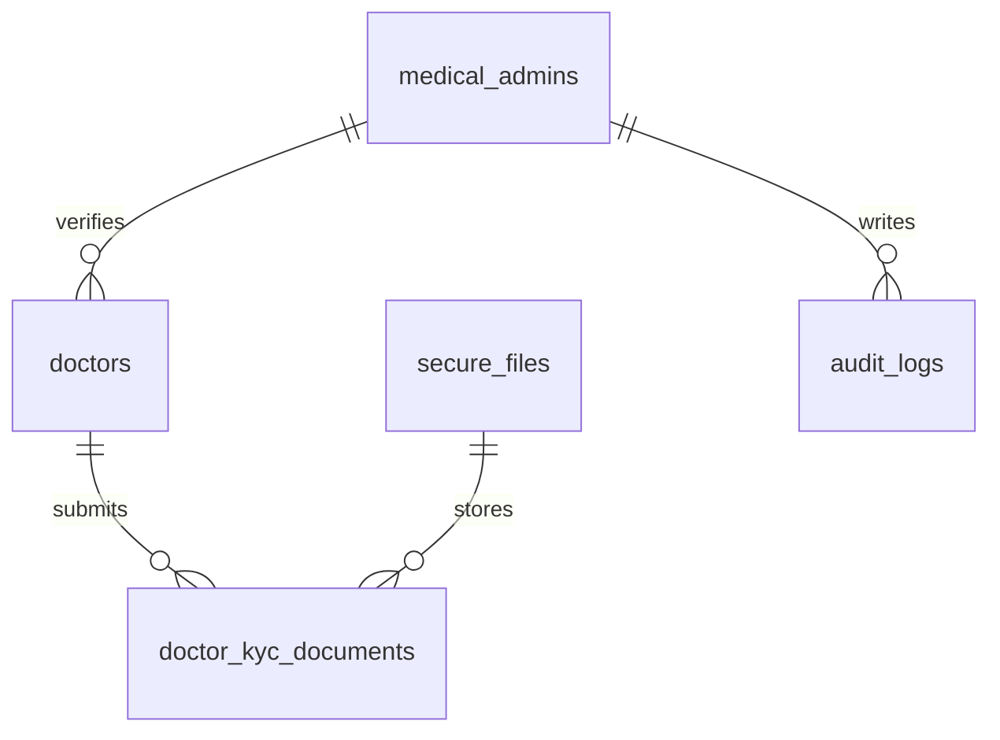
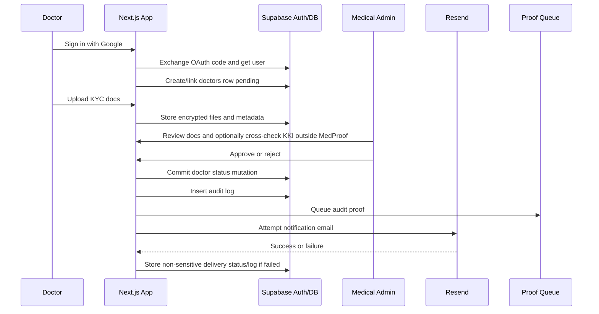

# Feature 01 - Foundation, Auth, Admin Bootstrap, And Doctor KYC

## Feature Goal

Create the secure Sprint 1 application foundation, Supabase SSR authentication, deterministic role resolution, Medical Admin bootstrap, and doctor KYC review workflow.

Exact table fields, constraints, allowed values, contract ABI, and source-flow details must follow `plans/sprint-01/Draft.md` whenever this spec is abbreviated.

## Success Metrics

- Patient, Doctor, and Medical Admin users authenticate with Supabase Google OAuth.
- Role resolution uses domain tables and `ADMIN_EMAIL_ALLOWLIST`, never user-editable auth metadata.
- Medical Admin access exists only for allowlisted Google emails.
- Doctor onboarding creates or links a `doctors` row with `account_status = 'pending'`.
- Pending and rejected doctors cannot access the doctor dashboard, QR Code, Doctor Access Code, patient grants, patient data views, Scope 1 input, or Doctor RAG.
- Approved doctors receive `qr_code_token`, unique 6-digit `doctor_access_code`, and a Resend approval email attempt.
- Admin review supports optional manual KKI cross-check outside MedProof without implementing KKI API automation.
- Email delivery failure never changes the approval or rejection result stored in the database.
- Admin UI and admin APIs never expose patient medical data.

## Scope

- Next.js 16 App Router scaffold with TypeScript, pnpm, Tailwind CSS, and shadcn/ui.
- Environment validation for:
  - Supabase URL and publishable/server keys.
  - Google OAuth configuration.
  - DeepSeek API configuration.
  - Resend API configuration.
  - AES-256-GCM main key.
  - `HASH_PEPPER`.
  - Amoy RPC URL.
  - relayer wallet private key.
  - MedProof contract address.
  - `ADMIN_EMAIL_ALLOWLIST`.
- Supabase browser/server clients using `@supabase/ssr`.
- Google OAuth sign-in and callback route.
- Role-aware routing and route guards for Patient, Doctor, and Medical Admin.
- Domain role resolution for `patients`, `doctors`, and `medical_admins`.
- Patient default account creation/linking for non-admin, non-doctor-onboarding users.
- Doctor onboarding form with full name, specialization, phone number, STR document, SIP document, and KTP/identity document.
- AES-encrypted KYC file upload to private Supabase Storage through `secure_files` and `doctor_kyc_documents`.
- Medical Admin dashboard for pending, approved, and rejected doctor registrations.
- Medical Admin doctor detail/review page with encrypted KYC preview after admin authorization.
- Admin manual verification workflow, including an optional admin-visible checklist or review note for official KKI/manual source checks performed outside MedProof.
- Approval/rejection mutation, audit event, blockchain pending audit job, and Resend email attempt.
- Resend failure state/log visible to admin without rolling back the doctor status mutation.

## Non-Scope

- Email/password auth.
- OTP auth.
- Public Medical Admin signup.
- Multi-role accounts except allowlisted demo admin behavior defined in `Draft.md`.
- Automatic KKI API verification.
- Storing official KKI API responses.
- Patient medical data access from admin UI or admin backend.
- Doctor patient search.
- Production clinical compliance certification.

## Assumptions

- Google OAuth is the only Sprint 1 auth method.
- Admin users are known before demo and configured in `ADMIN_EMAIL_ALLOWLIST`.
- Doctor KYC documents are STR, SIP, and KTP.
- Manual KKI verification may be performed by the admin outside MedProof. MedProof supports optional review notes/checklists; it does not call KKI APIs.
- Rejection reason can be plaintext because it is administrative review content, not patient medical content.
- Database account status is the source of truth for doctor approval/rejection.
- Email delivery is best-effort. A failed email attempt must be logged or surfaced for retry/manual handling, but it must not reverse or block the approved/rejected status.

## Dependencies

- Supabase Auth Google provider configured.
- Supabase SSR utilities from `@supabase/ssr`.
- Schema, RLS, private buckets, and encrypted file metadata from Feature 02.
- Resend account/API key.
- Audit writer and blockchain proof queue from Feature 06.
- UI state components and validation matrix from Feature 07.

## User Stories

- As a Patient, I can sign in with Google and be routed to onboarding or dashboard.
- As a Doctor, I can sign in with Google, submit KYC, and see pending, rejected, or approved account state.
- As a Medical Admin, I can sign in only when my email is allowlisted and review doctor registrations.
- As a Medical Admin, I can optionally manually cross-check a doctor's STR/SIP/KTP against official sources outside MedProof before approving or rejecting.
- As a rejected Doctor, I can see rejection status and reason without accessing doctor features.
- As an approved Doctor, I can access the dashboard and share my QR Code or Doctor Access Code.

## Acceptance Criteria

- Server routes call Supabase Auth validation before role resolution.
- Role resolution never trusts `raw_user_meta_data`, query params, local storage, or client-only role flags.
- An allowlisted admin email creates or links a `medical_admins` row.
- A non-allowlisted user cannot create, update, or impersonate `medical_admins`.
- Starting doctor onboarding creates or links one `doctors` row with `account_status = 'pending'`.
- A single auth user must not hold multiple roles in Sprint 1 except explicit allowlisted admin demo setup from `Draft.md`.
- Pending and rejected doctors have no active QR token, no Doctor Access Code, no patient list, and receive `403 Forbidden` on doctor feature routes.
- Approval sets:
  - `account_status = 'approved'`
  - `verified_by`
  - `verified_at`
  - unique `qr_code_token`
  - unique 6-digit numeric `doctor_access_code`
- Rejection sets:
  - `account_status = 'rejected'`
  - `rejection_reason`
  - no QR token
  - no Doctor Access Code
- Admin review supports optionally recording that STR, SIP, and KTP were manually checked. Any review note/status field must remain administrative-only and must not contain patient medical data.
- Approval writes an `audit_logs` row with `action = 'admin_doctor_approved'`, `access_status = 'approved'`, and queues an audit proof event.
- Rejection writes an `audit_logs` row with `action = 'admin_doctor_rejected'`, `access_status = 'rejected'`, and queues an audit proof event.
- Approval/rejection attempts Resend email delivery after the database mutation.
- If Resend fails:
  - The database approval/rejection result remains valid and is not rolled back.
  - The admin can see a non-sensitive email delivery failure/retry state or log.
  - The doctor status page follows the database status, not the email status.
  - A retry/manual notification path may be exposed to admin, but email retry must not mutate approval result.
- Admin UI has no patient-data navigation.
- Admin backend requests targeting patient profile, Scope 1, Scope 2, AI session, AI message, or patient audit rows return `403 Forbidden`.

## User Flow

```text
User clicks "Lanjutkan dengan Google"
-> Supabase OAuth redirects to callback
-> server exchanges code and validates user
-> role resolver checks allowlisted admin email, doctor onboarding state, or patient default
-> user lands on the correct role/status page
```

Doctor onboarding:

```text
Doctor signs in with Google
-> server creates/links doctors row with account_status pending
-> doctor submits full name, specialization, phone, STR, SIP, and KTP
-> server encrypts file bytes and filename metadata
-> encrypted files are uploaded to private bucket
-> secure_files and doctor_kyc_documents rows are written
-> doctor portal remains locked pending admin review
```

Medical Admin review:

```text
Admin signs in with allowlisted Google email
-> server creates/links medical_admins row
-> admin opens doctor review queue
-> admin previews encrypted KYC documents after authorization
-> admin may manually cross-check STR/SIP/KTP against official KKI or other official sources outside MedProof
-> admin approves or rejects
-> database status mutation is committed
-> audit row and blockchain pending job are created
-> Resend email is attempted
-> if email fails, admin sees retry/log state and doctor status remains based on database status
```

## UI Requirements

- Indonesian user-facing copy.
- Auth screen is an application entry, not a marketing landing page.
- Doctor status screens:
  - pending approval
  - rejected with rejection reason
  - approved dashboard
- Doctor onboarding/KYC form fields:
  - full name
  - specialization
  - phone number
  - STR upload
  - SIP upload
  - KTP/identity upload
- Admin dashboard lists doctor registrations with:
  - doctor name
  - specialization
  - registration date
  - status
  - filters by date, specialization, and status
- Admin detail page shows:
  - doctor profile fields
  - encrypted KYC document preview after admin authorization
  - optional manual KKI cross-check instruction/state
  - approve action
  - reject action with reason input
  - audit/proof status where available
  - email delivery status/retry note when Resend fails
- Required states:
  - loading
  - unauthorized
  - upload failure
  - pending doctor approval
  - rejected doctor account
  - email notification failure
  - blockchain pending/failed where proof applies

## Data Requirements

- `medical_admins`: allowlisted admin identities.
- `doctors`: auth mapping, profile fields, approval status, rejection reason, verifier, verification time, QR token, and 6-digit code.
- `secure_files`: encrypted file metadata and storage object references.
- `doctor_kyc_documents`: STR/SIP/KTP document rows.
- `audit_logs`: `admin_doctor_approved`, `admin_doctor_rejected`, and `doctor_kyc_email_notification_failed` events with the shared action/status taxonomy from Feature 02 and Feature 06.

Schema details, nullability, constraints, and encrypted field pattern are owned by Feature 02 and must match `Draft.md`.

## ERD / Data Model



## Architecture Notes

- Use `@supabase/ssr` browser/server clients and an App Router OAuth callback route.
- Use `supabase.auth.getUser()` or equivalent server-side validation before protected route logic.
- Store role state in domain tables; do not rely on `raw_user_meta_data`.
- Do not expose service role to the browser.
- Admin mutations that need service role must still verify authenticated admin identity and allowlist membership.
- Role resolution belongs in shared server utilities and route guards.
- Doctor code generation must:
  - generate a 6-digit numeric string
  - reject leading/trailing whitespace
  - retry on unique constraint collision
  - only assign a code to approved doctors
- KYC document object paths must not contain patient names, diagnoses, health content, or plaintext sensitive labels beyond allowed operational metadata.
- KYC document bytes must be AES-encrypted before Supabase Storage upload.
- Admin document preview must decrypt only after admin authorization.
- Resend delivery must run after the durable status mutation; email failure must not affect the doctor account status.
- Resend failure must write an admin-visible `audit_logs` row with `action = 'doctor_kyc_email_notification_failed'`, `access_status = 'failed'`, and a non-sensitive `reason`.

## Sequence Diagram



## Edge Cases

- Same Google account attempts patient and doctor onboarding.
- Allowlisted admin opens a patient route.
- Non-allowlisted user opens admin URL.
- Doctor submits incomplete KYC document set.
- KYC upload partially fails.
- KYC object upload succeeds but metadata insert fails.
- Admin approves a doctor whose KYC files are missing.
- Admin rejects without rejection reason.
- Doctor code collision.
- Resend email fails after approval/rejection mutation.
- Resend email succeeds but blockchain proof is pending/failed.
- Doctor is approved, then tries to access a route before session role refresh.

## Error States

- OAuth failure.
- Anonymous protected route access.
- Unauthorized admin.
- Pending doctor approval.
- Rejected doctor account.
- KYC upload failure.
- KYC preview unauthorized.
- Email notification failure with admin-visible non-sensitive retry/log state.
- Blockchain pending/failed for admin audit event.

## Task Breakdown Per Milestone

1. Scaffold app and baseline tooling.
2. Add environment validation.
3. Add Supabase SSR clients and OAuth callback.
4. Add role resolver and route guards.
5. Build doctor onboarding and encrypted KYC upload.
6. Build admin dashboard and doctor review detail.
7. Add optional manual KKI cross-check support/instruction in admin review.
8. Add approval/rejection mutations, QR/code generation, audit events, and blockchain pending job.
9. Add Resend email attempt and admin-visible failure/retry state.
10. Validate role boundaries and status screens.

## Validation Checklist

- [ ] Google OAuth callback creates a session.
- [ ] Server-side auth validation rejects anonymous protected routes.
- [ ] Admin allowlist blocks non-admin users.
- [ ] Role resolver does not use user-editable metadata.
- [ ] Starting doctor onboarding creates/links pending doctor.
- [ ] Pending/rejected doctors cannot access doctor dashboard, QR/code, patient grants, patient APIs, Scope 1, or RAG.
- [ ] Approved doctor receives QR token and unique 6-digit code.
- [ ] KYC docs are encrypted before storage.
- [ ] Admin can preview KYC docs only after admin authorization.
- [ ] Admin flow supports optional manual KKI cross-check outside MedProof.
- [ ] Approval writes `admin_doctor_approved` audit log and rejection writes `admin_doctor_rejected` audit log.
- [ ] Resend success path tested.
- [ ] Resend failure leaves database status unchanged and exposes non-sensitive retry/log state.
- [ ] Admin cannot query patient medical tables through UI, API, or RLS.

## Risks

- Multi-role ambiguity can weaken route guards. Sprint 1 defaults to one role per auth user except allowlisted admin demo setup.
- Resend failure can create communication mismatch. Database status is source of truth; admin sees retry/log state.
- Manual KKI verification can be mistaken for API automation. UI/docs must make clear the optional check happens outside MedProof.
- Service role can bypass RLS. Keep service role server-only, narrow, and guarded by authenticated admin/business checks.

## Decisions Log

| Decision | Final Choice |
|---|---|
| Auth method | Supabase Google OAuth only |
| Admin bootstrap | `ADMIN_EMAIL_ALLOWLIST` |
| Doctor verification | Manual admin review of STR, SIP, KTP |
| KKI verification | Optional manual cross-check outside MedProof; no KKI API automation |
| Doctor lookup identity | QR token plus unique 6-digit numeric code |
| Email notification | Resend best-effort; database status remains source of truth |
