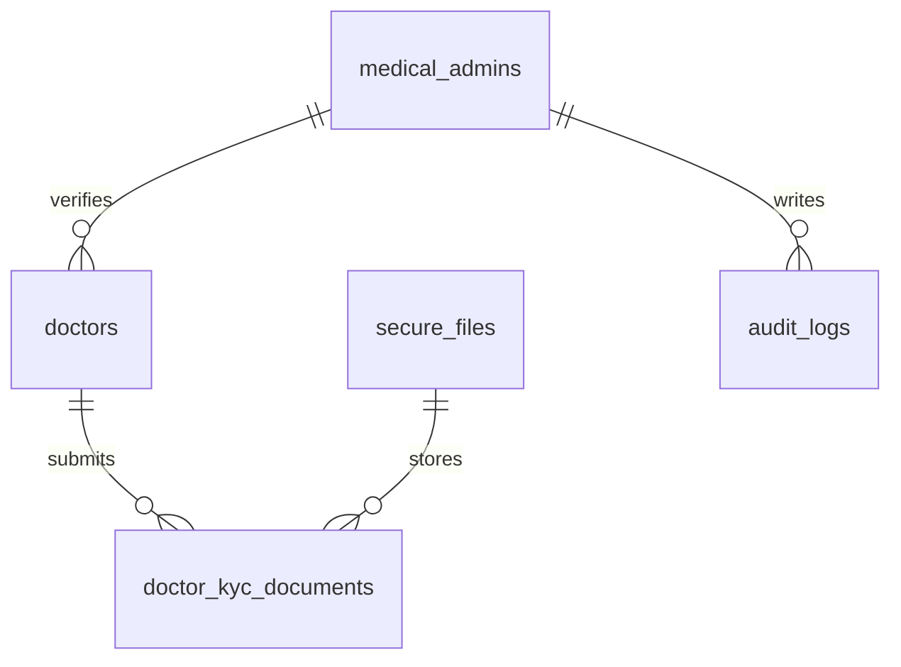
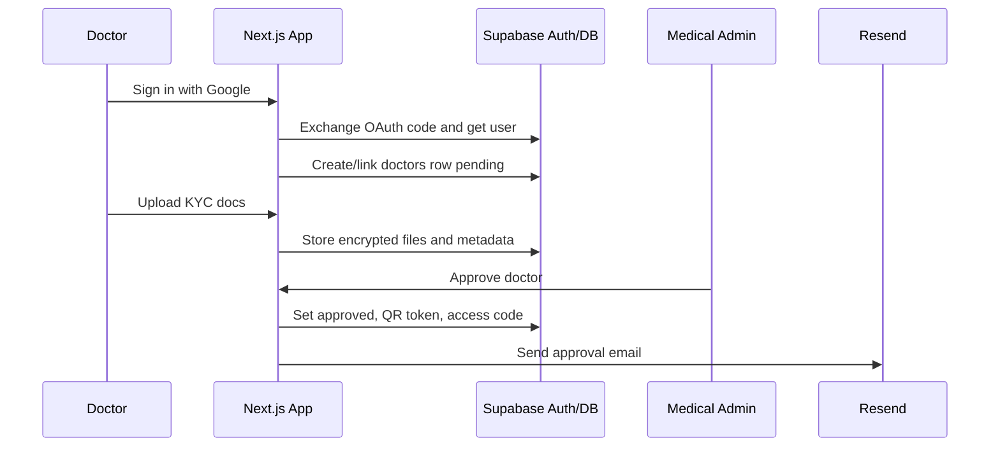

# Feature 01 - Foundation, Auth, And Admin KYC

## Feature Goal

Create the secure app foundation, Supabase SSR auth flow, role resolution, Medical Admin bootstrap, and doctor KYC review workflow.

## Success Metrics

- Patient, Doctor, and Medical Admin can sign in with Google OAuth.
- Admin access is limited to `ADMIN_EMAIL_ALLOWLIST`.
- Pending and rejected doctors cannot access doctor dashboard, QR Code, Doctor Access Code, patient grants, or patient data.
- Approved doctor receives QR Code token, 6-digit Doctor Access Code, and Resend email.
- Admin UI and API never expose patient medical data.

## Scope

- Next.js 16 App Router scaffold, TypeScript, pnpm, Tailwind, shadcn/ui.
- Environment validation for Supabase, Google OAuth, DeepSeek, Resend, AES key, hash pepper, Amoy RPC, relayer wallet, contract address, and admin allowlist.
- Supabase client utilities using `@supabase/ssr`.
- Google OAuth callback and role-aware routing.
- Domain role resolution for `patients`, `doctors`, and `medical_admins`.
- Doctor onboarding form and encrypted KYC upload.
- Medical Admin pending/rejected/approved review screens.

## Non-Scope

- Email/password auth, OTP auth, public admin signup, multi-role accounts outside allowlisted demo admin.
- Automatic KKI API verification.
- Patient medical data access from admin UI or admin backend.
- Doctor patient search.
- Production clinical compliance certification.

## Assumptions

- Google OAuth is the only Sprint 1 auth method.
- Admin users are known before demo and provided in `ADMIN_EMAIL_ALLOWLIST`.
- Doctor KYC documents are STR, SIP, and KTP.
- Rejection reason can be plaintext because it is administrative review content, not patient medical content.

## Dependencies

- Supabase Auth with Google provider configured.
- Supabase SSR docs and `@supabase/ssr`.
- Resend account/API key.
- `secure_files` and `doctor_kyc_documents` from Feature 02.
- Audit events from Feature 06 for admin review actions.

## User Stories

- As a Patient, I can sign in with Google and be routed to patient onboarding or dashboard.
- As a Doctor, I can sign in with Google, submit KYC, and see pending/rejected/approved account states.
- As a Medical Admin, I can sign in only when allowlisted and review doctor registrations.
- As a rejected Doctor, I can see rejection status and reason without accessing doctor features.

## Acceptance Criteria

- Server routes call Supabase Auth validation before role resolution.
- Role resolution never trusts user-editable `raw_user_meta_data`.
- Allowlisted admin email creates/links `medical_admins`.
- Non-allowlisted user cannot create or mutate `medical_admins`.
- Starting doctor onboarding creates/links a `doctors` row with `account_status = 'pending'`.
- Pending/rejected doctors have no QR token/code and receive 403 on doctor feature routes.
- Approval sets `account_status = 'approved'`, `verified_by`, `verified_at`, `qr_code_token`, and unique 6-digit `doctor_access_code`.
- Approval/rejection sends Resend email and writes audit log.

## User Flow

```text
User clicks "Lanjutkan dengan Google"
-> Supabase OAuth redirects to callback
-> server exchanges code and validates user
-> role resolver checks admin allowlist, doctor onboarding state, or patient default
-> user lands on role-specific state page
```

Doctor KYC:

```text
Doctor signs in
-> submits full name, specialization, phone, STR, SIP, KTP
-> files encrypted and uploaded to private bucket
-> admin reviews documents
-> approve creates QR/code and sends email
-> reject stores reason and sends email
```

## UI Requirements

- Indonesian copy.
- Auth screen is app entry, not marketing landing page.
- Doctor status screens: pending, rejected, approved.
- Admin dashboard lists pending doctors with filters by date, specialization, and status.
- Admin detail page previews encrypted KYC documents only after admin authorization.
- Required states: loading, unauthorized, upload failure, pending doctor approval, rejected doctor account.

## Data Requirements

- `medical_admins`: allowlisted admin identities.
- `doctors`: auth mapping, KYC profile fields, status, QR token, 6-digit code, rejection reason.
- `doctor_kyc_documents` and `secure_files`: encrypted STR/SIP/KTP metadata and storage objects.
- `audit_logs`: admin approval/rejection events.

## ERD / Data Model



## Architecture Notes

- Use `@supabase/ssr` browser/server clients and App Router callback route.
- Use `supabase.auth.getUser()` or equivalent server validation before protected route logic.
- Do not expose service role to browser. Admin mutations that need service role must still verify authenticated admin.
- Role resolution belongs in shared server utilities and route guards, not duplicated per page.
- Doctor code generation must retry on unique constraint collision and avoid leading/trailing whitespace.

## Sequence Diagram



## Edge Cases

- Same Google account attempts patient and doctor onboarding.
- Admin email not in allowlist tries admin URL.
- KYC upload partially fails.
- Resend email fails after approval/rejection DB mutation.
- Doctor code collision.

## Error States

- OAuth failure.
- Unauthorized admin.
- Pending doctor approval.
- Rejected doctor account.
- Upload failure.
- Email notification failure with admin-visible non-sensitive retry note.

## Task Breakdown Per Milestone

1. Scaffold app and env validation.
2. Add Supabase SSR clients and OAuth callback.
3. Add role resolver and route guards.
4. Build doctor onboarding and encrypted KYC upload.
5. Build admin dashboard/detail review.
6. Add approval/rejection email and audit events.
7. Validate role boundaries and status screens.

## Validation Checklist

- [ ] Google OAuth callback creates session.
- [ ] Server-side auth validation rejects anonymous protected routes.
- [ ] Admin allowlist blocks non-admin users.
- [ ] Pending/rejected doctors cannot access doctor dashboard or patient APIs.
- [ ] Approved doctor receives QR token and unique 6-digit code.
- [ ] KYC docs are encrypted before storage.
- [ ] Resend approval/rejection paths tested.
- [ ] Admin cannot query patient medical tables through UI, API, or RLS.

## Risks

- Multi-role ambiguity can weaken route guards. Sprint 1 defaults to one role per auth user except allowlisted admin demo setup.
- Resend failures can create notification mismatch. Store account status as source of truth and expose retry/manual note.

## Decisions Log

| Decision | Final Choice |
|---|---|
| Auth method | Supabase Google OAuth only |
| Admin bootstrap | `ADMIN_EMAIL_ALLOWLIST` |
| Doctor verification | Manual admin review of STR, SIP, KTP |
| Doctor lookup identity | QR token plus unique 6-digit numeric code |
