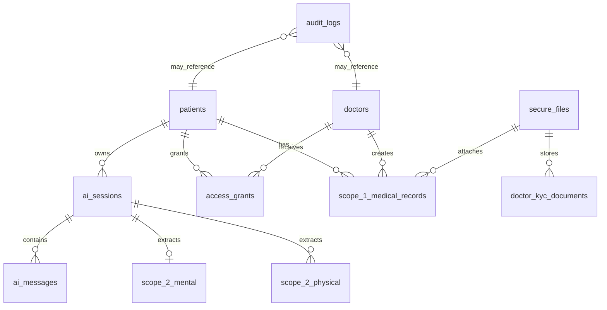
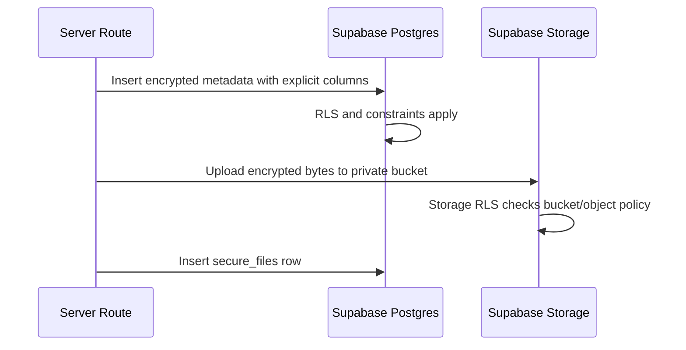

# Feature 02 - Supabase Data, RLS, Storage, And Encryption Model

## Feature Goal

Create the Supabase schema, RLS policies, storage buckets, Data API exposure rules, and encrypted field model required by Sprint 1.

## Success Metrics

- All user, grant, audit, session, record, extraction, and file metadata tables have RLS enabled.
- Intended client-accessed tables are reachable only with explicit grants and RLS policies.
- Private/internal tables or schemas are not reachable through the Data API.
- Patient, approved Doctor, pending Doctor, rejected Doctor, Medical Admin, and anonymous RLS checks pass.
- Health fields and file bytes are encrypted before persistence.

## Scope

- SQL migrations for core domain tables.
- RLS policies for patient ownership, approved doctor active grants, admin KYC-only access, and anonymous denial.
- Private Supabase Storage buckets for encrypted KYC documents and encrypted medical attachments.
- `secure_files` metadata for stored encrypted objects.
- Helper SQL functions only when needed for policy clarity/performance.
- Explicit Data API grants/exposure checks for Supabase 2026 table exposure behavior.

## Non-Scope

- Prisma or ORM schema.
- Vector DB, embeddings, GraphQL dependency, or LlamaIndex.
- Direct plaintext health-content SQL analytics.
- Storage of decrypted files or plaintext medical content.
- Broad database views unless they are `security_invoker = true` or unexposed.

## Assumptions

- Tables live in `public` unless implementation chooses private schemas for helper/internal tables.
- Security-definer functions, if needed, live in private/unexposed schema.
- Service role is used only server-side and never shipped to browser.
- RLS policy names should be descriptive and role-scoped.

## Dependencies

- Supabase CLI or migration workflow selected during scaffold.
- Supabase docs for RLS, Storage policies, and Data API grants.
- Crypto utilities from implementation milestone 4.

## User Stories

- As a Patient, I can only read my own medical records, AI sessions, messages, Scope 2 data, grants, and access history.
- As an approved Doctor, I can read only patient data covered by active non-revoked grants.
- As a pending/rejected Doctor, I cannot read patient data or doctor-only resources.
- As a Medical Admin, I can review KYC data but not patient medical data.
- As an anonymous user, I cannot access protected data.

## Acceptance Criteria

- Migrations create required tables from `overview.md` and `Draft.md`.
- RLS is enabled on all exposed-schema tables.
- Policies use `TO authenticated` where appropriate and avoid unauthenticated policy work.
- Policies use indexed columns for `auth_user_id`, `patient_id`, `doctor_id`, grant expiry/revocation, and status checks.
- No production API query uses `SELECT *`.
- UPDATE policies include corresponding SELECT policies where updates are required.
- Data API grants are explicit for tables intentionally queried through Supabase clients.
- Private helper functions/tables are not exposed to `anon` or broad `authenticated` access.

## User Flow

```text
Authenticated request
-> Supabase maps JWT to authenticated role
-> RLS checks domain table ownership or active grant
-> app receives only permitted rows
-> server decrypts only after business authorization
```

## UI Requirements

- None standalone. UI surfaces from other feature specs must show empty/unauthorized/expired/revoked states based on RLS/API outcomes.

## Data Requirements

Required tables:

- `patients`, `doctors`, `medical_admins`
- `secure_files`, `doctor_kyc_documents`
- `ai_sessions`, `ai_messages`
- `scope_2_mental`, `scope_2_physical`
- `scope_1_medical_records`
- `access_grants`
- `audit_logs`

Required encrypted-field pattern:

```sql
<field_name>_ciphertext TEXT
<field_name>_iv TEXT
<field_name>_tag TEXT
key_version TEXT NOT NULL DEFAULT 'v1'
```

## ERD / Data Model



## Architecture Notes

- Prefer SQL constraints for operational metadata only; encrypted health content must be validated before encryption in app code.
- Use partial unique indexes where possible for one active patient-doctor grant.
- Use object paths that do not reveal plaintext health data or patient names.
- Store file SHA-256 of encrypted bytes for integrity, not plaintext bytes.
- Keep RLS policy helper functions stable, minimal, indexed, and private.
- Run Supabase advisors after migrations.

## Sequence Diagram



## Edge Cases

- Table created but not exposed to Data API as expected.
- RLS policy allows row but table grants block API request.
- UPDATE silently affects zero rows because SELECT policy missing.
- Storage upsert fails because SELECT/UPDATE policy missing.
- Helper function in exposed schema becomes callable through RPC.

## Error States

- Unauthorized.
- Forbidden by RLS.
- Storage upload/download denied.
- Migration/advisor failure.
- Data API table not reachable due missing grants.

## Task Breakdown Per Milestone

1. Create migration with tables, constraints, indexes, and buckets.
2. Add RLS policies and storage policies.
3. Add explicit grants/exposure statements for intended Data API tables.
4. Add private helper functions only where justified.
5. Generate TypeScript DB types after schema stabilizes.
6. Add RLS and storage access tests.
7. Run advisors and fix security/performance findings.

## Validation Checklist

- [ ] Migration applies cleanly.
- [ ] RLS enabled on protected public tables.
- [ ] Explicit grants/exposure match intended API surface.
- [ ] Anonymous receives no protected rows.
- [ ] Patient can only access own rows.
- [ ] Approved Doctor can access only active granted rows.
- [ ] Pending/rejected Doctor receives no doctor/patient data.
- [ ] Medical Admin can access KYC/admin rows only.
- [ ] Storage upload/download policies match role and grant rules.
- [ ] Supabase security and performance advisors reviewed.

## Risks

- RLS can appear correct while Data API grants block intended access. Validate both.
- Security-definer helpers can bypass RLS if exposed. Keep in private schema and revoke broad execute.
- Encrypted columns prevent DB checks for values. Validate before encryption.

## Decisions Log

| Decision | Final Choice |
|---|---|
| DB access | Supabase JS and SQL migrations |
| ORM | No Prisma |
| Scope 2 model | Row-based canonical data plus encrypted raw extraction support |
| Storage | Private buckets with app-encrypted bytes |
| Supabase 2026 exposure | Explicit grants/exposure validation required |
