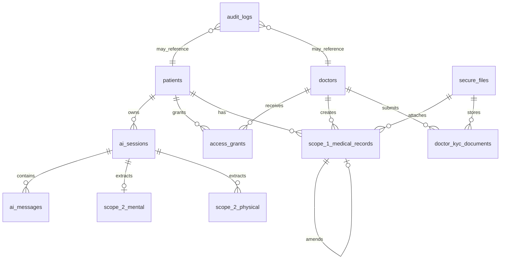
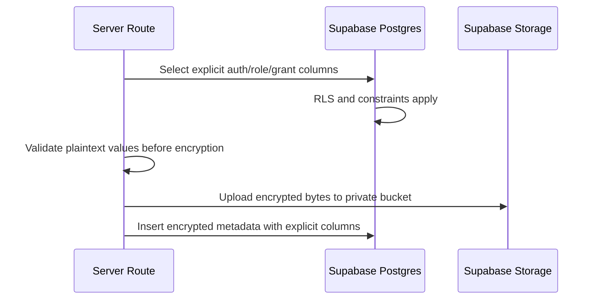

# Feature 02 - Supabase Data, RLS, Storage, And Encryption Model

## Feature Goal

Create the exact Sprint 1 Supabase schema, constraints, indexes, RLS policies, private Storage buckets, Data API exposure rules, and encrypted-field model required by `plans/sprint-01/Draft.md`.

Exact table fields, constraints, allowed values, contract ABI, and source-flow details must follow `plans/sprint-01/Draft.md` whenever this spec is abbreviated.

## Success Metrics

- SQL migrations create every required Sprint 1 table with exact fields, nullability, defaults, and foreign keys from `Draft.md`.
- All user, grant, audit, session, record, extraction, and file metadata tables have RLS enabled.
- Intended client-accessed tables have explicit grants and RLS policies.
- Private/internal tables, helper schemas, and privileged functions are not reachable by `anon` or broad `authenticated` access.
- Supabase Data API reachability and RLS row authorization are validated separately.
- Patient, approved Doctor, pending Doctor, rejected Doctor, Medical Admin, and anonymous RLS checks pass.
- Health fields and file bytes are AES-256-GCM encrypted before persistence.
- No plaintext medical content appears in database rows, logs, storage objects, or blockchain payloads.

## Scope

- SQL migrations for required core domain tables.
- Exact encrypted field triplets:
  - `<field>_ciphertext`
  - `<field>_iv`
  - `<field>_tag`
  - `key_version`
- Database constraints for plaintext operational metadata.
- Server-side validation requirements for encrypted values that cannot be checked by Postgres after encryption.
- RLS policies for:
  - patient ownership
  - approved doctor access through active non-revoked grants
  - pending/rejected doctor denial
  - Medical Admin KYC-only access
  - anonymous denial
- Private Supabase Storage buckets for:
  - encrypted KYC documents
  - encrypted medical attachments
- `secure_files` metadata for encrypted stored objects.
- Storage policies for upload, preview, and download.
- Helper SQL functions only when needed for RLS clarity/performance.
- Explicit Data API grants/exposure checks for Supabase 2026 behavior.
- RLS and storage access tests.

## Non-Scope

- Prisma or ORM schema.
- Vector DB, embeddings, GraphQL dependency, or LlamaIndex.
- Direct plaintext health-content SQL analytics.
- Storing decrypted files or plaintext medical content.
- Broad database views unless `security_invoker = true` and explicitly authorized, or the view is in an unexposed schema.
- Patient data deletion or retention automation.
- Production clinical database certification.

## Assumptions

- Tables live in `public` unless implementation chooses a private schema for helpers/internal tables.
- Security-definer functions, if needed, live in a private/unexposed schema.
- Service role is used only server-side and never shipped to the browser.
- RLS policy names are descriptive and role-scoped.
- Data API grants are explicit because Supabase table reachability and RLS row authorization are separate layers.
- Encrypted clinical values cannot rely on database `CHECK` constraints. They must be validated in server code before encryption.
- Plaintext operational metadata may use database constraints.

## Dependencies

- Supabase CLI or migration workflow selected during scaffold.
- Supabase Auth and `@supabase/ssr` from Feature 01.
- Crypto utilities from implementation milestone 4.
- Audit/hash utilities from Feature 06.
- UI and validation flows from Feature 07.

## User Stories

- As a Patient, I can only read my own profile, AI sessions, messages, Scope 1 records, Scope 2 rows, grants, proof status, and access history.
- As an approved Doctor, I can read only patient data covered by an active, unexpired, non-revoked grant.
- As a pending or rejected Doctor, I cannot read patient data or doctor-only resources.
- As a Medical Admin, I can review doctor KYC data and KYC audit events, but not patient medical data.
- As an anonymous user, I cannot access protected data.

## Required Tables

The migration must create these tables unless an existing app scaffold already provides a strict equivalent that preserves every field and rule:

- `patients`
- `doctors`
- `medical_admins`
- `secure_files`
- `doctor_kyc_documents`
- `ai_sessions`
- `ai_messages`
- `scope_2_mental`
- `scope_2_physical`
- `scope_1_medical_records`
- `access_grants`
- `audit_logs`

## Exact Schema

### `patients`

```sql
patient_id UUID PRIMARY KEY DEFAULT gen_random_uuid()
auth_user_id UUID UNIQUE NOT NULL
full_name TEXT NOT NULL
email TEXT UNIQUE NOT NULL
date_of_birth DATE NULL
profiling_data_ciphertext TEXT NULL
profiling_data_iv TEXT NULL
profiling_data_tag TEXT NULL
key_version TEXT NOT NULL DEFAULT 'v1'
created_at TIMESTAMPTZ NOT NULL DEFAULT now()
updated_at TIMESTAMPTZ NULL
```

Rules:

- `auth_user_id` maps to `auth.users.id`.
- No password, OTP secret, or credential hash is stored.
- `profiling_data_*` contains encrypted patient profiling health/lifestyle free text.
- Patient medical profile content must not be plaintext.

### `doctors`

```sql
doctor_id UUID PRIMARY KEY DEFAULT gen_random_uuid()
auth_user_id UUID UNIQUE NOT NULL
full_name TEXT NOT NULL
email TEXT UNIQUE NOT NULL
phone_number TEXT NULL
specialization TEXT NULL
account_status TEXT NOT NULL DEFAULT 'pending'
rejection_reason TEXT NULL
verified_by UUID NULL REFERENCES medical_admins(admin_id)
verified_at TIMESTAMPTZ NULL
qr_code_token TEXT UNIQUE NULL
doctor_access_code CHAR(6) UNIQUE NULL
created_at TIMESTAMPTZ NOT NULL DEFAULT now()
updated_at TIMESTAMPTZ NULL
```

Required constraints:

```sql
CHECK (account_status IN ('pending', 'approved', 'rejected'))
CHECK (doctor_access_code IS NULL OR doctor_access_code ~ '^[0-9]{6}$')
```

Rules:

- Pending/rejected doctors must not have active QR token or Doctor Access Code.
- Approved doctors receive `qr_code_token` and unique 6-digit `doctor_access_code`.
- `rejection_reason` is administrative content and may be plaintext.

### `medical_admins`

```sql
admin_id UUID PRIMARY KEY DEFAULT gen_random_uuid()
auth_user_id UUID UNIQUE NOT NULL
full_name TEXT NOT NULL
email TEXT UNIQUE NOT NULL
created_at TIMESTAMPTZ NOT NULL DEFAULT now()
```

Rules:

- Rows are created/linked only for Google OAuth users in `ADMIN_EMAIL_ALLOWLIST`.
- Non-allowlisted users cannot create or mutate admin records.

### `secure_files`

```sql
file_id UUID PRIMARY KEY DEFAULT gen_random_uuid()
owner_role TEXT NOT NULL
owner_id UUID NOT NULL
bucket_name TEXT NOT NULL
object_path TEXT NOT NULL
original_filename_ciphertext TEXT NOT NULL
original_filename_iv TEXT NOT NULL
original_filename_tag TEXT NOT NULL
mime_type TEXT NOT NULL
file_size_bytes BIGINT NOT NULL
file_sha256 TEXT NOT NULL
key_version TEXT NOT NULL DEFAULT 'v1'
created_at TIMESTAMPTZ NOT NULL DEFAULT now()
```

Required constraints:

```sql
CHECK (owner_role IN ('patient', 'doctor', 'medical_admin'))
CHECK (file_size_bytes >= 0)
```

Rules:

- KYC documents and medical attachments both use `secure_files`.
- Stored object bytes must already be AES-encrypted before upload.
- `file_sha256` is the hash of encrypted bytes, not plaintext bytes.
- `object_path` must not reveal patient name, diagnosis, symptoms, prescription, mood, anxiety, sleep, raw quote, or other medical content.

### `doctor_kyc_documents`

```sql
document_id UUID PRIMARY KEY DEFAULT gen_random_uuid()
doctor_id UUID NOT NULL REFERENCES doctors(doctor_id)
document_type TEXT NOT NULL
file_id UUID NOT NULL REFERENCES secure_files(file_id)
created_at TIMESTAMPTZ NOT NULL DEFAULT now()
```

Required constraints:

```sql
CHECK (document_type IN ('str', 'sip', 'ktp'))
UNIQUE (doctor_id, document_type)
```

Rules:

- Required document types are STR, SIP, and KTP.
- Documents are encrypted private files.

### `ai_sessions`

```sql
session_id UUID PRIMARY KEY DEFAULT gen_random_uuid()
patient_id UUID NOT NULL REFERENCES patients(patient_id)
session_title_ciphertext TEXT NULL
session_title_iv TEXT NULL
session_title_tag TEXT NULL
summary_text_ciphertext TEXT NULL
summary_text_iv TEXT NULL
summary_text_tag TEXT NULL
ended_at TIMESTAMPTZ NULL
end_reason TEXT NULL
summary_generated_at TIMESTAMPTZ NULL
key_version TEXT NOT NULL DEFAULT 'v1'
created_at TIMESTAMPTZ NOT NULL DEFAULT now()
updated_at TIMESTAMPTZ NULL
```

Required constraints:

```sql
CHECK (
  end_reason IS NULL
  OR end_reason IN ('manual_end', 'inactivity_timeout', 'new_session_started')
)
```

Rules:

- `summary_text_*` remains null until the session ends and summary generation succeeds.
- `end_reason` allowed values are exactly `manual_end`, `inactivity_timeout`, and `new_session_started`.

### `ai_messages`

```sql
message_id UUID PRIMARY KEY DEFAULT gen_random_uuid()
session_id UUID NOT NULL REFERENCES ai_sessions(session_id)
patient_id UUID NOT NULL REFERENCES patients(patient_id)
sender_role TEXT NOT NULL
message_text_ciphertext TEXT NOT NULL
message_text_iv TEXT NOT NULL
message_text_tag TEXT NOT NULL
key_version TEXT NOT NULL DEFAULT 'v1'
created_at TIMESTAMPTZ NOT NULL DEFAULT now()
```

Required constraints:

```sql
CHECK (sender_role IN ('patient', 'ai'))
```

Rules:

- Every patient and AI message is encrypted before insert.
- No decrypted message text may be logged.

### `scope_2_mental`

```sql
log_id UUID PRIMARY KEY DEFAULT gen_random_uuid()
patient_id UUID NOT NULL REFERENCES patients(patient_id)
session_id UUID NOT NULL REFERENCES ai_sessions(session_id)
log_date DATE NOT NULL
mood_score_ciphertext TEXT NULL
mood_score_iv TEXT NULL
mood_score_tag TEXT NULL
anxiety_level_ciphertext TEXT NULL
anxiety_level_iv TEXT NULL
anxiety_level_tag TEXT NULL
sleep_hours_ciphertext TEXT NULL
sleep_hours_iv TEXT NULL
sleep_hours_tag TEXT NULL
trigger_notes_ciphertext TEXT NULL
trigger_notes_iv TEXT NULL
trigger_notes_tag TEXT NULL
raw_quote_ciphertext TEXT NOT NULL
raw_quote_iv TEXT NOT NULL
raw_quote_tag TEXT NOT NULL
is_emergency_flagged_ciphertext TEXT NOT NULL
is_emergency_flagged_iv TEXT NOT NULL
is_emergency_flagged_tag TEXT NOT NULL
extraction_confidence_ciphertext TEXT NULL
extraction_confidence_iv TEXT NULL
extraction_confidence_tag TEXT NULL
ai_model TEXT NULL
schema_version TEXT NOT NULL DEFAULT 'v1'
raw_extraction_jsonb_ciphertext TEXT NULL
raw_extraction_jsonb_iv TEXT NULL
raw_extraction_jsonb_tag TEXT NULL
raw_quote_hash TEXT NULL
key_version TEXT NOT NULL DEFAULT 'v1'
created_at TIMESTAMPTZ NOT NULL DEFAULT now()
updated_at TIMESTAMPTZ NULL
UNIQUE (session_id)
```

Rules:

- At most one mental Scope 2 row exists per AI session.
- All clinical values are encrypted.
- `raw_quote_hash` is optional for mental Scope 2 traceability and may be null.
- `raw_quote_hash`, when present, may be plaintext because it is a hash for traceability, not raw quote content.
- Mental duplicate prevention is enforced by `UNIQUE (session_id)`, not by `raw_quote_hash`.
- Mood/anxiety/sleep/confidence ranges are validated in server code before encryption because DB cannot inspect ciphertext.

### `scope_2_physical`

```sql
log_id UUID PRIMARY KEY DEFAULT gen_random_uuid()
patient_id UUID NOT NULL REFERENCES patients(patient_id)
session_id UUID NOT NULL REFERENCES ai_sessions(session_id)
log_date DATE NOT NULL
symptom_type_ciphertext TEXT NULL
symptom_type_iv TEXT NULL
symptom_type_tag TEXT NULL
severity_ciphertext TEXT NULL
severity_iv TEXT NULL
severity_tag TEXT NULL
body_location_ciphertext TEXT NULL
body_location_iv TEXT NULL
body_location_tag TEXT NULL
duration_note_ciphertext TEXT NULL
duration_note_iv TEXT NULL
duration_note_tag TEXT NULL
raw_quote_ciphertext TEXT NOT NULL
raw_quote_iv TEXT NOT NULL
raw_quote_tag TEXT NOT NULL
is_emergency_flagged_ciphertext TEXT NOT NULL
is_emergency_flagged_iv TEXT NOT NULL
is_emergency_flagged_tag TEXT NOT NULL
extraction_confidence_ciphertext TEXT NULL
extraction_confidence_iv TEXT NULL
extraction_confidence_tag TEXT NULL
ai_model TEXT NULL
schema_version TEXT NOT NULL DEFAULT 'v1'
raw_extraction_jsonb_ciphertext TEXT NULL
raw_extraction_jsonb_iv TEXT NULL
raw_extraction_jsonb_tag TEXT NULL
raw_quote_hash TEXT NOT NULL
key_version TEXT NOT NULL DEFAULT 'v1'
created_at TIMESTAMPTZ NOT NULL DEFAULT now()
updated_at TIMESTAMPTZ NULL
```

Required duplicate-prevention constraint:

```sql
UNIQUE (session_id, raw_quote_hash)
```

Rules:

- One row is written per primary symptom per session.
- Do not create duplicate rows for the same session and raw quote hash.
- Server extraction must populate non-null `raw_quote_hash` for every persisted `scope_2_physical` row. Because `raw_quote_ciphertext` is required, the server computes `raw_quote_hash` from the plaintext raw quote before encryption.
- If `raw_quote_hash` cannot be computed, the physical row must not be inserted.
- The database must enforce `raw_quote_hash TEXT NOT NULL` and `UNIQUE (session_id, raw_quote_hash)` so duplicates cannot bypass integrity through null values or privileged/server mistakes.
- Severity, body location, duration, symptom type, emergency flag, and confidence are validated before encryption.

### `scope_1_medical_records`

```sql
record_id UUID PRIMARY KEY DEFAULT gen_random_uuid()
patient_id UUID NOT NULL REFERENCES patients(patient_id)
doctor_id UUID NOT NULL REFERENCES doctors(doctor_id)
amends_record_id UUID NULL REFERENCES scope_1_medical_records(record_id)
record_type_ciphertext TEXT NOT NULL
record_type_iv TEXT NOT NULL
record_type_tag TEXT NOT NULL
title_ciphertext TEXT NOT NULL
title_iv TEXT NOT NULL
title_tag TEXT NOT NULL
description_ciphertext TEXT NULL
description_iv TEXT NULL
description_tag TEXT NULL
attachment_file_id UUID NULL REFERENCES secure_files(file_id)
record_hash TEXT NOT NULL
blockchain_tx_hash TEXT NULL
blockchain_status TEXT NOT NULL DEFAULT 'pending'
blockchain_last_error TEXT NULL
key_version TEXT NOT NULL DEFAULT 'v1'
created_at TIMESTAMPTZ NOT NULL DEFAULT now()
```

Required constraints:

```sql
CHECK (blockchain_status IN ('pending', 'confirmed', 'failed'))
```

Required server-side enum validation before encryption:

```text
record_type IN ('lab', 'xray', 'diagnosis', 'prescription', 'vaccine', 'action', 'note')
```

Rules:

- `record_type` is clinical content and is stored encrypted, so the allowed values are enforced by server validation before encryption, not by a database check on ciphertext.
- Scope 1 records are append-only.
- Doctors cannot edit or delete saved records.
- Corrections create a new row with `amends_record_id`.
- Each original and amendment record gets its own `record_hash`, audit event, and blockchain status.
- `record_hash = SHA256(canonical_json(encrypted_record_payload))`.

### `access_grants`

```sql
grant_id UUID PRIMARY KEY DEFAULT gen_random_uuid()
patient_id UUID NOT NULL REFERENCES patients(patient_id)
doctor_id UUID NOT NULL REFERENCES doctors(doctor_id)
can_view_scope1 BOOLEAN NOT NULL DEFAULT FALSE
can_view_scope2_mental BOOLEAN NOT NULL DEFAULT FALSE
can_view_scope2_physical BOOLEAN NOT NULL DEFAULT FALSE
can_download_attachments BOOLEAN NOT NULL DEFAULT FALSE
granted_at TIMESTAMPTZ NOT NULL DEFAULT now()
expires_at TIMESTAMPTZ NOT NULL
is_revoked BOOLEAN NOT NULL DEFAULT FALSE
revoked_at TIMESTAMPTZ NULL
replaced_by_grant_id UUID NULL REFERENCES access_grants(grant_id)
consent_hash TEXT NOT NULL
blockchain_tx_hash TEXT NULL
blockchain_status TEXT NOT NULL DEFAULT 'pending'
blockchain_last_error TEXT NULL
created_at TIMESTAMPTZ NOT NULL DEFAULT now()
```

Required constraints:

```sql
CHECK (
  can_view_scope1 = TRUE
  OR can_view_scope2_mental = TRUE
  OR can_view_scope2_physical = TRUE
)
CHECK (isfinite(expires_at))
CHECK (expires_at > granted_at)
CHECK (
  (is_revoked = FALSE AND revoked_at IS NULL)
  OR (is_revoked = TRUE AND revoked_at IS NOT NULL)
)
CHECK (blockchain_status IN ('pending', 'confirmed', 'failed'))
```

Required active-grant invariant:

```sql
-- Enforced by the grant create/replace transaction:
-- 1. Acquire a transaction-scoped advisory lock keyed by patient_id + doctor_id.
-- 2. Run the mutation inside one database RPC/transaction. Use SERIALIZABLE isolation for SQL RPC implementations. If the selected runtime cannot set SERIALIZABLE, the transaction-scoped advisory lock, row locks, and post-check below are still mandatory and become the concurrency boundary.
-- 3. Lock existing access_grants rows for the patient_id + doctor_id pair.
-- 4. Revoke the latest active grant where expires_at > now() and is_revoked = FALSE.
-- 5. Insert the new grant.
-- 6. Re-run the active-grant query in the same transaction.
-- 7. Commit only if the post-transaction active-grant query returns exactly one active row.
-- 8. On advisory-lock failure, serialization conflict, or post-check failure, roll back and return a controlled conflict error. The caller may retry the whole mutation.
```

Rules:

- Use boolean scope flags, not a single enum.
- At least one `can_view_*` flag must be true.
- `expires_at` is always required and finite.
- The database must enforce finite expiry with `CHECK (isfinite(expires_at))`; the server must also reject `expires_at <= transaction_timestamp()`.
- Custom duration has no maximum, but UI must warn when expiry is more than 30 days away.
- Only one active patient-doctor grant may exist at a time.
- Creating a new grant for the same patient-doctor pair revokes the prior active grant, sets `replaced_by_grant_id`, and creates new consent/audit blockchain events.
- Concurrent grant creation for the same patient-doctor pair must never create multiple active grants.
- Concurrent conflict behavior is deterministic: one transaction commits; competing transactions roll back with a controlled conflict/serialization error and do not leave partial grant, consent, or audit rows.
- `consent_hash = SHA256(canonical_json(consent_event_payload_with_hmac_ids))`.

### `audit_logs`

```sql
log_id UUID PRIMARY KEY DEFAULT gen_random_uuid()
actor_auth_user_id UUID NOT NULL
actor_role TEXT NOT NULL
action TEXT NOT NULL
target_type TEXT NULL
target_id UUID NULL
patient_id UUID NULL REFERENCES patients(patient_id)
doctor_id UUID NULL REFERENCES doctors(doctor_id)
access_status TEXT NOT NULL
reason TEXT NULL
ip_address INET NULL
audit_event_hash TEXT NOT NULL
blockchain_tx_hash TEXT NULL
blockchain_status TEXT NOT NULL DEFAULT 'pending'
blockchain_last_error TEXT NULL
created_at TIMESTAMPTZ NOT NULL DEFAULT now()
```

Required constraints:

```sql
CHECK (actor_role IN ('patient', 'doctor', 'medical_admin'))
CHECK (access_status IN ('accepted', 'approved', 'rejected', 'allowed', 'denied', 'created', 'amended', 'revoked', 'replaced', 'failed', 'mismatch'))
CHECK (blockchain_status IN ('pending', 'confirmed', 'failed'))
```

Rules:

- `reason` must not contain plaintext medical content.
- `ip_address` is optional operational metadata.
- `audit_event_hash = SHA256(canonical_json(audit_event_payload_with_hmac_ids))`.
- Patient-facing access history shows patient-relevant grant, revoke, doctor view, denied attempt, RAG, and proof-status events.
- Admin UI shows only KYC audit events.

Required audit events:

- `ai_processing_consent_accepted` with `access_status = 'accepted'`.
- `patient_grant_created` with `access_status = 'created'`.
- `patient_grant_replaced` with `access_status = 'replaced'`.
- `patient_grant_revoked` with `access_status = 'revoked'`.
- `doctor_patient_view_allowed` with `access_status = 'allowed'`.
- `doctor_patient_view_denied` with `access_status = 'denied'`.
- `scope1_record_created` with `access_status = 'created'`.
- `scope1_record_amended` with `access_status = 'amended'`.
- `doctor_rag_requested` with `access_status = 'allowed'`.
- `admin_doctor_approved` with `access_status = 'approved'`.
- `admin_doctor_rejected` with `access_status = 'rejected'`.
- `doctor_access_code_lookup_failed` with `access_status = 'failed'`.
- `doctor_kyc_email_notification_failed` with `access_status = 'failed'`.
- `blockchain_verification_mismatch` with `access_status = 'mismatch'`.

## Index Requirements

Create indexes for all access-control and lookup paths:

- `patients.auth_user_id`
- `patients.email`
- `doctors.auth_user_id`
- `doctors.email`
- `doctors.account_status`
- `doctors.qr_code_token`
- `doctors.doctor_access_code`
- `medical_admins.auth_user_id`
- `medical_admins.email`
- `doctor_kyc_documents.doctor_id`
- `secure_files.owner_role, owner_id`
- `ai_sessions.patient_id`
- `ai_messages.session_id`
- `ai_messages.patient_id`
- `scope_2_mental.patient_id`
- `scope_2_mental.session_id`
- `scope_2_physical.patient_id`
- `scope_2_physical.session_id`
- `scope_1_medical_records.patient_id`
- `scope_1_medical_records.doctor_id`
- `scope_1_medical_records.amends_record_id`
- `access_grants.patient_id, doctor_id, granted_at`
- `access_grants.doctor_id, expires_at, is_revoked`
- `audit_logs.patient_id, created_at`
- `audit_logs.doctor_id, created_at`
- `audit_logs.actor_auth_user_id, created_at`
- `audit_logs.action`

## Access Query Behavior

All access-sensitive SQL must use explicit columns. `SELECT *` is forbidden in production API logic.

The active grant check must use this deterministic behavior:

```sql
SELECT
  grant_id,
  can_view_scope1,
  can_view_scope2_mental,
  can_view_scope2_physical,
  can_download_attachments,
  expires_at
FROM access_grants
WHERE doctor_id = :doctor_id
  AND patient_id = :patient_id
  AND expires_at > now()
  AND is_revoked = FALSE
ORDER BY granted_at DESC
LIMIT 1;
```

Required behavior:

- If no row is returned, backend returns `403 Forbidden`.
- If the row exists but the requested scope flag is false, backend returns `403 Forbidden`.
- If access is expired or revoked, backend returns `403 Forbidden`.
- Ordering must prefer the latest grant by `granted_at DESC`.
- UI countdowns are informational only; server-side checks are authoritative.

## RLS Requirements

Enable RLS on every table in exposed schemas.

Policies must enforce:

- Anonymous users receive no protected rows.
- Patients can read their own rows.
- Patients can write only their own allowed rows through guarded routes.
- Approved doctors can read patient rows only through active grants.
- Doctors with `account_status != 'approved'` cannot access doctor features or patient data.
- Medical Admin can read/write doctor KYC review rows only.
- Medical Admin cannot read patient profile, Scope 1, Scope 2, AI session, AI message, or patient audit rows.
- UPDATE policies include corresponding SELECT policies where updates are required.
- Policies use `TO authenticated` where applicable.
- Policies avoid user-editable metadata in JWT claims.

Service-role routes:

- Must be server-only.
- Must still validate authenticated user and business role.
- Must not return decrypted data before authorization.
- Must not be used as a shortcut around missing RLS.

## Data API Grants And Exposure

Data API reachability must be handled explicitly:

- Bundle `GRANT`/`REVOKE` statements with RLS migrations.
- Grant only minimum privileges for intended Supabase client access.
- Revoke access for private/internal tables and helper functions.
- Keep security-definer helpers in private/unexposed schemas.
- Do not rely on Supabase default grants.
- Validate intended reachable tables and intended private tables separately.

Required validation:

- Missing grants fail with a controlled error during tests, not at demo time.
- Granted tables still enforce RLS.
- Private helpers are not callable through Data API RPC.
- Views, if any, are `security_invoker = true` or unexposed.

Required Data API privilege matrix:

| Object | `anon` | `authenticated` Data API | Server-only/service role | Notes |
|---|---|---|---|---|
| `patients` | none | `SELECT`, `INSERT`, `UPDATE` through RLS | yes | Patient own rows only; no delete. |
| `doctors` | none | `SELECT`, `INSERT`, `UPDATE` through RLS | yes | Doctor self onboarding; admin status mutation server-only. |
| `medical_admins` | none | `SELECT` own allowlisted row only | yes | Create/link/mutate through guarded allowlist server route. |
| `secure_files` | none | `SELECT`, `INSERT` through RLS/storage policy | yes | No direct decrypted bytes; no delete. |
| `doctor_kyc_documents` | none | `SELECT`, `INSERT` through RLS | yes | Doctor own insert; admin authorized select. |
| `ai_sessions` | none | `SELECT`, `INSERT`, `UPDATE` through RLS | yes | Patient owned; no delete. |
| `ai_messages` | none | `SELECT`, `INSERT` through RLS | yes | Patient owned; no update/delete. |
| `scope_2_mental` | none | `SELECT`, `INSERT` through RLS | yes | Patient own and approved doctor active-grant select; no update/delete in Sprint 1. |
| `scope_2_physical` | none | `SELECT`, `INSERT` through RLS | yes | Patient own and approved doctor active-grant select; no update/delete in Sprint 1. |
| `scope_1_medical_records` | none | `SELECT`, `INSERT` through RLS | yes | Approved doctor insert only with active Scope 1 grant; no update/delete. |
| `access_grants` | none | `SELECT`, `INSERT`, `UPDATE` through guarded RPC/RLS | yes | Patient-owned grant mutations only; no delete. |
| `audit_logs` | none | `SELECT` through RLS | yes | Inserts only through guarded server audit writer. |
| private helper schemas/functions | none | none | yes | Revoke broad `EXECUTE`; expose no RPC helpers unless explicitly listed. |

## Storage Requirements

Buckets:

- Private encrypted KYC documents bucket.
- Private encrypted medical attachments bucket.

Rules:

- Stored bytes are encrypted before upload.
- No decrypted file is stored in Supabase Storage.
- Storage object paths must not include patient names, diagnoses, symptoms, prescriptions, raw quotes, or other plaintext medical content.
- KYC previews require authorized Medical Admin.
- Medical attachment preview requires approved doctor and active Scope 1 grant.
- Medical attachment download requires active Scope 1 grant and `can_download_attachments = TRUE`.
- Storage upsert policies, if used, must include required `INSERT`, `SELECT`, and `UPDATE` permissions.

## Encryption Requirements

Use AES-256-GCM for:

- Patient profiling health/lifestyle text.
- AI session titles and summaries.
- AI messages.
- Scope 2 mental values.
- Scope 2 physical values.
- Scope 1 record type, title, and description.
- Original filenames.
- File bytes.

Plaintext may be stored only for operational metadata:

- IDs and foreign keys.
- `auth_user_id`.
- Role/status fields.
- Access scope flags.
- `log_date`, timestamps, expiry, and revocation status.
- Blockchain transaction hashes and proof status.
- Non-sensitive error summaries.
- Non-health routing/status metadata.

Never log:

- plaintext health fields
- decrypted payloads
- raw AI prompts
- decrypted files
- raw quotes

## ERD / Data Model



## Architecture Notes

- Prefer SQL constraints for operational metadata.
- Validate encrypted clinical values before encryption in app code.
- Use the advisory-lock/serializable transaction invariant for active-grant uniqueness.
- Keep RLS helper functions stable, minimal, indexed, and private.
- Run Supabase security and performance advisors after migrations.
- Generate TypeScript database types after schema stabilizes.
- Do not use `SELECT *` in access-sensitive routes.
- Decrypt only after Supabase Auth validation, role checks, RLS/business checks, and scope checks pass.

## Sequence Diagram



## Edge Cases

- Table is created but not exposed to Data API as expected.
- RLS policy allows a row but Data API grants block access.
- Data API grants expose a table without RLS.
- UPDATE affects zero rows because SELECT policy is missing.
- Storage upsert fails because SELECT/UPDATE policy is missing.
- Helper function in exposed schema becomes callable through RPC.
- Server attempts to insert `scope_2_physical` without computed `raw_quote_hash`.
- Two grant replacement requests race and create two active grants.
- Service role route forgets business authorization.
- Encrypted value validation is skipped because DB constraints cannot inspect ciphertext.
- Pending/rejected doctor has a stale QR/code value.

## Error States

- Unauthorized.
- Forbidden by RLS.
- Forbidden by business access check.
- Storage upload denied.
- Storage download denied.
- Migration failure.
- Advisor failure.
- Data API table not reachable due missing grants.
- Data API table unexpectedly reachable.
- Encryption validation failure.
- Active grant conflict.

## Task Breakdown Per Milestone

1. Create migration with exact tables, constraints, indexes, and buckets.
2. Add RLS policies and storage policies.
3. Add explicit Data API grants/exposure statements.
4. Add private helper functions only where justified.
5. Add server-side validators for encrypted values.
6. Generate TypeScript DB types after schema stabilizes.
7. Add RLS, grant, and storage access tests.
8. Run Supabase advisors and fix security/performance findings.

## Validation Checklist

- [ ] Migration applies cleanly.
- [ ] Required tables and fields match `Draft.md`.
- [ ] Nullability matches `Draft.md`.
- [ ] Enum/check constraints exist for plaintext constrained fields.
- [ ] Server validators enforce allowed encrypted clinical values before encryption.
- [ ] `scope_2_mental UNIQUE(session_id)` exists.
- [ ] `scope_2_physical` duplicate prevention for `session_id + raw_quote_hash` exists.
- [ ] Every persisted `scope_2_physical` row has non-null `raw_quote_hash`.
- [ ] Only one active patient-doctor grant can exist.
- [ ] Concurrent grant creation for the same patient-doctor pair cannot create two active grants.
- [ ] Grant conflict/serialization failure rolls back without partial grant, consent, or audit rows.
- [ ] `audit_logs` includes `access_status`, `reason`, and `ip_address`.
- [ ] RLS enabled on protected public tables.
- [ ] Explicit grants/exposure match intended API surface.
- [ ] Anonymous receives no protected rows.
- [ ] Patient can access only own rows.
- [ ] Approved Doctor can access only active granted rows.
- [ ] Pending/rejected Doctor receives no doctor/patient data.
- [ ] Medical Admin can access KYC/admin rows only.
- [ ] Medical Admin cannot access patient profile, Scope 1, Scope 2, AI sessions, AI messages, or patient audit rows.
- [ ] Storage upload/download policies match role and grant rules.
- [ ] Active grant query uses explicit columns and latest ordering.
- [ ] Missing, expired, revoked, or missing-scope access returns `403 Forbidden`.
- [ ] Supabase security and performance advisors reviewed.
- [ ] Plaintext DB inspection finds no medical content.
- [ ] Storage byte inspection confirms encrypted-only objects.

## Risks

- RLS can appear correct while Data API grants block intended access. Validate both.
- Security-definer helpers can bypass RLS if exposed. Keep them in private schemas and revoke broad execute.
- Encrypted columns prevent DB checks for values. Validate before encryption.
- Grant replacement can create duplicate active grants if not transactional.
- Service role can bypass RLS. Use only in guarded server routes/jobs.

## Decisions Log

| Decision | Final Choice |
|---|---|
| DB access | Supabase JS and SQL migrations |
| ORM | No Prisma |
| Scope 2 model | Row-based canonical data plus encrypted raw extraction support |
| Storage | Private buckets with app-encrypted bytes |
| Supabase Data API exposure | Explicit grants/exposure validation required |
| Encrypted value validation | Server-side before encryption |
| Access-sensitive SQL | Explicit column selection, no `SELECT *` |
