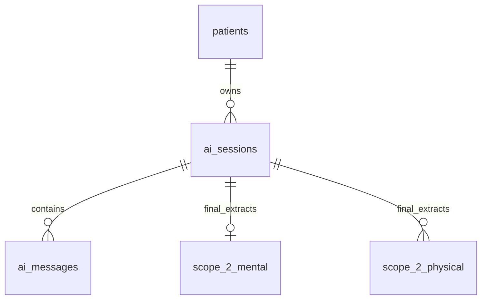
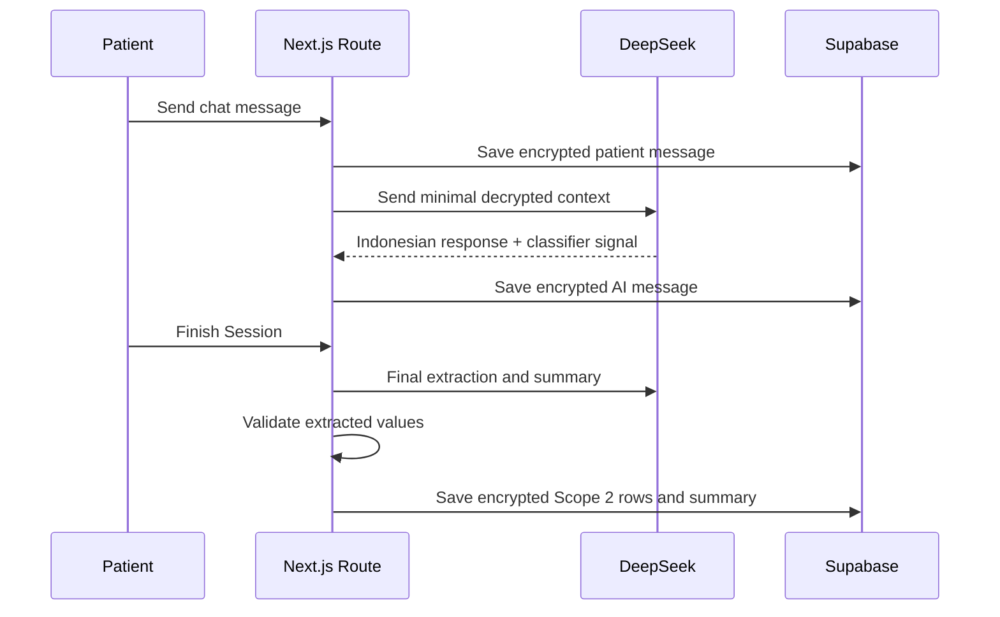

# Feature 03 - Patient AI Journaling And Scope 2 Extraction

## Feature Goal

Implement patient onboarding, AI processing consent, one-time AI profiling, AI chat sessions, encrypted message storage, final Scope 2 extraction, emergency flagging, encrypted session summaries, and patient dashboard summaries.

Exact table fields, constraints, allowed values, contract ABI, and source-flow details must follow `plans/sprint-01/Draft.md` whenever this spec is abbreviated.

## Success Metrics

- Patient sees AI processing consent and demo/test-data disclaimer before AI use.
- AI responses are Indonesian and non-diagnostic.
- Patient profiling content is encrypted in `patients.profiling_data_*`.
- Patient and AI chat messages are stored encrypted.
- Final extraction writes at most one `scope_2_mental` row per session.
- Final extraction writes one `scope_2_physical` row per primary symptom per session.
- Unknown fields remain null; AI does not invent severity, duration, body location, mood, anxiety, sleep, or symptoms.
- Emergency/self-harm indicators store encrypted emergency flags and show cautious guidance without dispatch or automatic alerts.
- Doctor-facing Scope 2 data includes provenance/disclaimer and is not editable when accessed through an authorized doctor flow.

## Scope

- Patient first-login onboarding.
- AI processing consent and competition/demo disclaimer.
- One-time AI profiling conversation.
- Patient dashboard sections for greeting, summaries, grants, access history, and proof status.
- ChatGPT-like patient chat with session list, main chat area, streaming response, and Finish Session action.
- Encrypted `ai_sessions` and `ai_messages`.
- Lightweight emergency/context classification during chat.
- Final extraction and summary when session ends.
- Encrypted Scope 2 mental/physical row writes.
- AI failure and extraction validation states.

## Non-Scope

- Manual patient editing of Scope 2 rows.
- Doctor editing of Scope 2 rows.
- AI diagnosis.
- Treatment recommendation.
- Emergency dispatch.
- Automatic doctor alert.
- Automatic admin alert.
- Predictive insights.
- Advanced chart generation.
- Vector search or embedding-based RAG.

## Assumptions

- DeepSeek is the AI model.
- Vercel AI SDK powers streaming UI.
- AI consent clearly states that relevant decrypted demo/test health text may be sent to DeepSeek for chat, extraction, summaries, and authorized doctor RAG.
- AI consent acceptance is persisted as an `audit_logs` row with `action = 'ai_processing_consent_accepted'`, `actor_role = 'patient'`, `access_status = 'accepted'`, and blockchain status fields from the audit proof model.
- Patient free-text profiling is encrypted in `patients.profiling_data_*`.
- AI chat and AI responses use Indonesian.
- Sprint 1 uses demo/test data only.

## Dependencies

- Patient auth and role resolution from Feature 01.
- Schema, encrypted fields, RLS, and duplicate constraints from Feature 02.
- Crypto utilities and safe logging.
- Audit/proof status from Feature 06 where relevant.
- UI state components from Feature 07.

## User Stories

- As a Patient, I can sign in and understand AI processing before using chat.
- As a Patient, I can complete one-time profiling in Indonesian.
- As a Patient, I can journal naturally in Indonesian.
- As a Patient, I can finish a session and see a summary.
- As a Patient, I can see recent Scope 1 and Scope 2 summaries, active grants, access history, and proof status from my dashboard.
- As a Doctor, I can trust Scope 2 rows because they trace back to patient chat sessions and raw quotes when I access them through an authorized grant.

## Acceptance Criteria

- AI chat cannot start until the patient exists and AI consent is recorded.
- AI consent is recorded only when the patient explicitly accepts the consent screen; server code gates chat by the presence of the patient-owned `ai_processing_consent_accepted` audit event.
- Onboarding shows:
  - AI processing consent
  - DeepSeek data-processing disclosure
  - competition/demo/test-data disclaimer
  - non-diagnostic AI disclaimer
- One-time profiling may ask conversationally, in Indonesian, about:
  - how the patient learned about MedProof
  - age and date of birth
  - current condition or feeling
  - work, study, or usual activity
  - lifestyle and environment context
  - known illness history if the patient is willing to share
- Profiling content is encrypted before persistence.
- `ai_sessions.summary_text_*` is null until the session ends.
- Session ends on:
  - Finish Session
  - 30 minutes of no patient activity
  - starting a new session while a prior session has no summary
- `ai_sessions.end_reason` uses only `manual_end`, `inactivity_timeout`, or `new_session_started`.
- Each patient message is encrypted and stored before AI processing.
- Each AI message is encrypted and stored after the model response.
- Lightweight emergency/context classification runs during chat.
- Final extraction runs only when a session ends.
- Final extraction validates values before encryption.
- Unknown values remain null.
- AI must not infer or invent medical values not stated by the patient.
- `scope_2_mental` has `UNIQUE (session_id)` and represents session-level mental data.
- `scope_2_physical` prevents duplicate symptom rows from the same `session_id + raw_quote_hash`.
- Every persisted `scope_2_physical` row has a non-null `raw_quote_hash`; if a raw quote hash cannot be computed, the physical row is rejected before insert.
- `scope_2_mental.raw_quote_hash` is optional traceability metadata and may be null.
- `scope_2_physical.raw_quote_hash` is required for every persisted physical row and enforced by Feature 02 with `raw_quote_hash TEXT NOT NULL` plus `UNIQUE (session_id, raw_quote_hash)`.
- Emergency/self-harm guidance is cautious, Indonesian, and recommends professional or emergency help when relevant.
- No emergency dispatch, doctor alert, or admin alert is triggered.
- Doctors can view extracted Scope 2 data only through active authorized grants.
- Doctor-visible Scope 2 data must include provenance/disclaimer and must not be editable by doctor or patient in Sprint 1.

## Patient Onboarding Flow

```text
Patient signs in with Google
-> server creates or links patients row
-> patient sees AI processing consent
-> patient sees competition/demo/test-data disclaimer
-> patient accepts consent
-> server writes ai_processing_consent_accepted audit event
-> patient completes one-time AI profiling
-> profiling content is encrypted into patients.profiling_data_*
-> patient lands on dashboard
```

## AI Profiling Requirements

The profiling conversation may ask, in Indonesian, about:

1. How the patient learned about MedProof.
2. Age and date of birth.
3. Current condition or feeling.
4. Work, study, or usual activity.
5. Lifestyle and environment context.
6. Known illness history, only if the patient is willing to share.

Rules:

- Profiling is one-time for Sprint 1.
- Profiling is conversational and contextual; it must not force sensitive answers.
- Profiling text is health/lifestyle content and must be encrypted.
- Profiling must not diagnose or recommend treatment.
- Profiling must not require the patient to disclose sensitive illness history if they decline.

## Patient Dashboard Requirements

Dashboard must show:

- Personal greeting.
- Primary CTA to open AI Chat.
- Scope 1 recent records summary.
- Scope 2 recent journal summary.
- Active doctor access list with expiry/countdown.
- Access history entry point or recent access history entries.
- Blockchain/proof verification indicators where relevant.

Required empty states:

- No Scope 1 records.
- No AI sessions.
- No Scope 2 journal data.
- No active doctor grants.
- Pending blockchain proof.

Rules:

- Dashboard summaries are read from authorized server data.
- Decryption happens only after patient ownership authorization.
- Proof indicators use database `blockchain_status` and verify endpoint results.

## Patient AI Chat Flow

```text
Patient opens AI Chat
-> server validates patient and consent
-> server creates ai_sessions row when a session starts
-> patient sends message
-> server encrypts and stores patient message
-> server sends minimal decrypted context to DeepSeek
-> AI streams Indonesian non-diagnostic response
-> server encrypts and stores AI message
-> lightweight classifier records emergency/context signal
-> patient finishes session or session closes by timeout/new-session rule
-> final extractor validates structured output
-> Scope 2 rows are encrypted and stored
-> encrypted session summary is generated
```

## Backend Behavior

- Create `ai_sessions` row when a session starts.
- Store each patient and AI message encrypted in `ai_messages`.
- Run lightweight AI classification during chat for emergency flag/context awareness.
- Run final extraction when session ends.
- Write at most one `scope_2_mental` row per session.
- Write one `scope_2_physical` row per primary symptom per session.
- Store traceability through:
  - `session_id`
  - encrypted `raw_quote`
  - required non-null `raw_quote_hash` for persisted physical rows
  - `ai_model`
  - `schema_version`
  - encrypted raw extraction JSON
- Generate encrypted `summary_text` after session end.

## AI Extraction Rules

- Do not diagnose.
- Do not invent severity, duration, body location, mood, anxiety, sleep, symptoms, or triggers.
- Leave unknown fields null.
- Validate all structured values before encryption.
- Reject invalid extraction values before persistence.
- Persist model and schema version for traceability.
- No patient manual edit workflow in Sprint 1.
- Doctors see provenance/disclaimer, not editable extracted data.

## Emergency Behavior

- If emergency or self-harm indicators are detected, store an encrypted emergency flag value.
- AI gives cautious Indonesian guidance to seek professional or emergency help.
- No emergency dispatch.
- No automatic doctor alert.
- No automatic admin alert.
- Emergency flag display to doctors requires active authorized Scope 2 grant and backend decryption.

## Doctor-Facing Scope 2 Rule

When Scope 2 data is shown to a doctor:

- Doctor must be authenticated.
- Doctor must be approved.
- Grant must be active, unexpired, and non-revoked.
- Grant must include the requested Scope 2 category.
- Doctor sees extracted data only for permitted categories.
- Doctor sees provenance/source, including session/date and authorized raw quote where available.
- Doctor sees a non-diagnostic disclaimer.
- Extracted Scope 2 rows are not editable by doctors.
- Manual patient editing of extracted Scope 2 rows is out of scope.

## UI Requirements

- Indonesian UI copy and AI responses.
- Patient dashboard includes all required sections from this spec.
- Chat screen includes:
  - session list
  - main chat area
  - message composer
  - streaming response state
  - Finish Session action
- Health-related copy must be non-diagnostic.
- AI consent must be visible before chat use.
- Required states:
  - loading
  - empty
  - AI failure
  - unauthorized
  - consent required
  - emergency guidance
  - extraction validation failure
  - blockchain pending where proof applies

## Data Requirements

- `patients.profiling_data_*`: encrypted profiling content.
- `ai_sessions`: encrypted title and summary, end metadata, key version.
- `ai_messages`: encrypted patient/AI messages.
- `scope_2_mental`: encrypted mood/anxiety/sleep/trigger/raw quote/emergency/confidence/raw extraction.
- `scope_2_physical`: encrypted symptom/severity/location/duration/raw quote/emergency/confidence/raw extraction.

Exact schema, nullability, constraints, and indexes are defined in Feature 02 and must match `Draft.md`.

## ERD / Data Model



## Architecture Notes

- Store patient message before calling AI.
- Store AI message after receiving AI output.
- Never log decrypted messages, prompts, extraction JSON, raw quotes, or summaries.
- Keep prompt construction server-side.
- Send minimal necessary decrypted context to DeepSeek.
- Separate lightweight emergency detection from final canonical extraction.
- Do not use database constraints to validate encrypted values; validate structured AI output before encryption.
- Use idempotent session-finalization logic so repeated Finish Session or timeout jobs do not duplicate Scope 2 rows.
- Use duplicate prevention from Feature 02 for `scope_2_physical`.

## Sequence Diagram



## Edge Cases

- Patient leaves without pressing Finish Session.
- Patient starts a new session while prior session has no summary.
- Finish Session is clicked multiple times.
- Timeout job and manual finish run concurrently.
- AI extraction returns invalid values.
- One session contains both mental and physical data.
- One physical session mentions multiple symptoms.
- Two symptoms share the same raw quote hash.
- Emergency indicator appears in ambiguous language.
- AI provider fails mid-stream.
- AI response succeeds but message persistence fails.
- Extraction succeeds but summary generation fails.
- Patient has no recorded AI consent acceptance.
- Doctor requests Scope 2 data without required grant.

## Error States

- Consent required.
- Unauthorized patient.
- Empty session list.
- No Scope 2 data yet.
- AI failure.
- Streaming failure.
- Extraction validation failure.
- Summary generation failure.
- Emergency guidance state.
- Blockchain pending where proof applies.

## Task Breakdown Per Milestone

1. Add patient onboarding and AI consent state.
2. Add one-time profiling flow with required topics.
3. Encrypt and persist profiling result.
4. Build patient dashboard sections and empty states.
5. Build chat shell and session list.
6. Implement encrypted session/message persistence.
7. Add streaming DeepSeek route with safe prompt construction.
8. Add lightweight emergency/context classifier.
9. Add final session closure rules.
10. Add extraction validator.
11. Add encrypted Scope 2 writes and duplicate prevention.
12. Add encrypted summary generation.
13. Add dashboard summaries and required states.

## Validation Checklist

- [ ] Patient cannot use AI chat without consent.
- [ ] Consent text includes DeepSeek processing and demo/test-data disclosure.
- [ ] Consent acceptance writes `ai_processing_consent_accepted` audit row before AI chat starts.
- [ ] Profiling asks required Draft topics.
- [ ] Profiling content persists encrypted.
- [ ] Dashboard shows greeting, AI CTA, Scope 1 summary, Scope 2 summary, active grants, access history, and proof indicators.
- [ ] Messages persist encrypted.
- [ ] Decrypted text does not appear in logs.
- [ ] Finish Session writes summary and Scope 2 rows.
- [ ] Timeout closes inactive session after 30 minutes.
- [ ] Starting a new session closes prior unsummarized session.
- [ ] Invalid extraction values are rejected before encryption.
- [ ] Unknown extraction fields remain null.
- [ ] Mental one-row-per-session rule enforced.
- [ ] Physical one-row-per-symptom and no duplicate session/quote-hash rule enforced.
- [ ] Persisted physical rows have non-null `raw_quote_hash`.
- [ ] Emergency flag behavior is non-diagnostic and no dispatch/alert occurs.
- [ ] Doctor-facing Scope 2 output includes provenance/disclaimer and is not editable.

## Risks

- AI may infer values not said by patient. Enforce schema validator and null for unknown fields.
- Streaming failure can leave partial state. Persist user message first and surface retry.
- External AI sees decrypted text. Consent and demo/test-data boundary must be visible.
- Finalization races can duplicate Scope 2 rows. Use database constraints and idempotent server logic.

## Decisions Log

| Decision | Final Choice |
|---|---|
| Scope 2 input | AI extraction from conversation, not manual form |
| Extraction timing | Lightweight classifier during chat, final extraction at session end |
| AI model | DeepSeek |
| AI language | Indonesian |
| Scope 2 edits | Not editable in Sprint 1 |
| Doctor Scope 2 display | Authorized extracted data with provenance/disclaimer |
