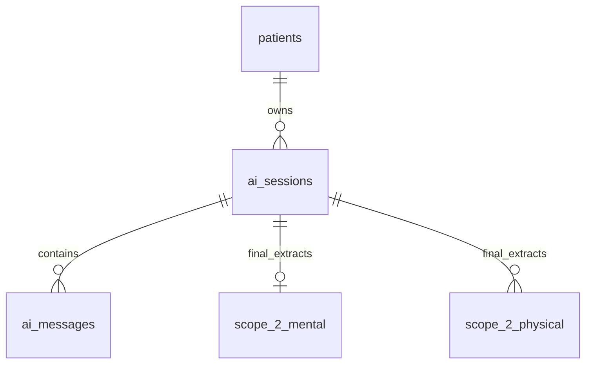
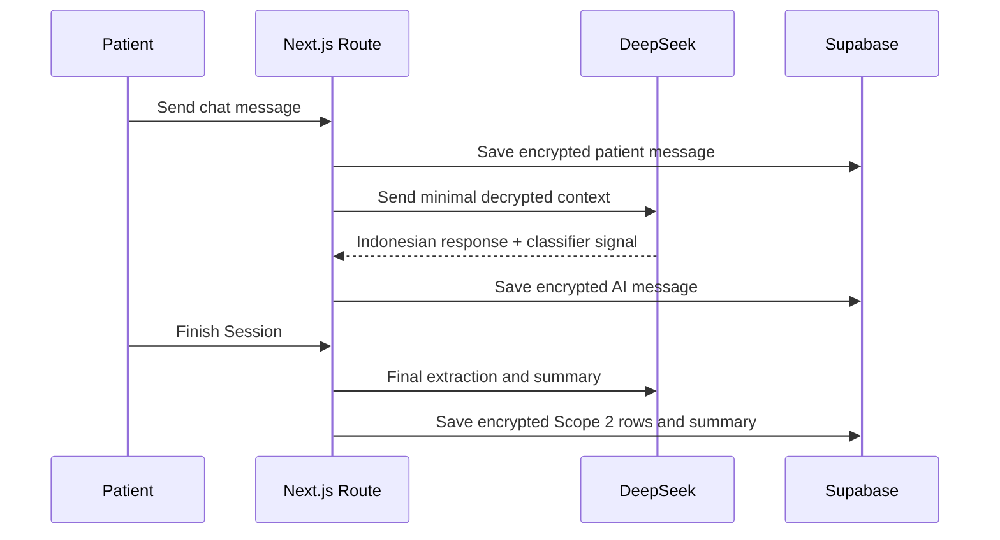

# Feature 03 - Patient AI Journaling And Scope 2 Extraction

## Feature Goal

Implement patient onboarding, AI processing consent, AI chat sessions, encrypted message storage, final Scope 2 extraction, emergency flagging, and encrypted session summaries.

## Success Metrics

- Patient consent is shown before AI processing.
- AI responses are Indonesian and non-diagnostic.
- Patient and AI messages are stored encrypted.
- Final extraction writes at most one `scope_2_mental` row per session and one `scope_2_physical` row per primary symptom.
- Unknown fields remain null; AI does not invent medical values.
- Emergency indicators store encrypted flags and show cautious guidance without dispatch/alert.

## Scope

- Patient first-login onboarding and AI processing consent.
- One-time AI profiling conversation.
- ChatGPT-like patient chat with session list and Finish Session.
- Encrypted `ai_sessions` and `ai_messages`.
- Lightweight emergency/context classification during chat.
- Final extraction and summary when session ends.
- Scope 2 mental/physical encrypted row writes.

## Non-Scope

- Manual patient editing of Scope 2 rows.
- AI diagnosis or treatment recommendation.
- Emergency dispatch, automatic doctor alert, or admin alert.
- Predictive insights or advanced chart generation.
- Vector search or embedding-based RAG.

## Assumptions

- DeepSeek is the AI model.
- Vercel AI SDK powers streaming UI.
- AI consent text clearly says relevant decrypted demo/test health text may be sent to DeepSeek.
- Patient free-text profiling is encrypted in `patients.profiling_data_*`.

## Dependencies

- Auth and patient role from Feature 01.
- Encrypted schema and RLS from Feature 02.
- Safe logging and crypto utilities.
- Audit/proof status from Feature 06 where relevant.

## User Stories

- As a Patient, I can sign in and understand AI processing before using chat.
- As a Patient, I can journal naturally in Indonesian.
- As a Patient, I can finish a session and see a summary.
- As a Doctor later, I can trust Scope 2 rows trace back to patient chat sessions and raw quotes.

## Acceptance Criteria

- AI chat cannot start until patient exists and AI consent is recorded.
- `ai_sessions.summary_text_*` is null until the session ends.
- Session ends on Finish Session, 30 minutes inactivity, or starting a new session while prior session lacks summary.
- Final extraction validates values before encryption.
- `scope_2_mental` has `UNIQUE (session_id)` and represents session-level mental data.
- `scope_2_physical` prevents duplicate symptom rows from same session/quote hash.
- `raw_quote` and optional `raw_quote_hash` are persisted for traceability.
- Emergency/self-harm guidance is cautious and recommends professional/emergency help when relevant.

## User Flow

```text
Patient opens app
-> accepts AI consent and demo disclaimer
-> completes profiling chat
-> opens AI Chat
-> session row created
-> each message saved encrypted
-> lightweight classifier checks emergency/context
-> patient finishes session or timeout/new session closes it
-> final extractor writes Scope 2 rows
-> summarizer writes encrypted session summary
```

## UI Requirements

- Indonesian UI copy and AI responses.
- Patient dashboard shows AI Chat CTA, recent Scope 2 summary, empty state, and AI failure state.
- Chat screen has session list, main chat area, message composer, streaming response, Finish Session action.
- Health-related copy must be non-diagnostic.
- Required states: loading, empty, AI failure, unauthorized, emergency guidance, blockchain pending where proof applies.

## Data Requirements

- `ai_sessions`: encrypted title and summary, end metadata.
- `ai_messages`: encrypted patient/AI messages.
- `scope_2_mental`: encrypted mood/anxiety/sleep/trigger/raw quote/emergency/confidence/raw extraction.
- `scope_2_physical`: encrypted symptom/severity/location/duration/raw quote/emergency/confidence/raw extraction.
- `patients.profiling_data_*`: encrypted profiling result.

## ERD / Data Model



## Architecture Notes

- Store messages before sending/after receiving AI output so chat history is durable.
- Never log decrypted messages, prompts, extraction JSON, or summaries.
- Keep prompt construction server-side.
- Separate lightweight emergency detection from final canonical extraction.
- Do not use DB constraints to validate encrypted values; validate structured AI output before encryption.
- Persist `ai_model` and `schema_version` for extraction traceability.

## Sequence Diagram



## Edge Cases

- Patient leaves without pressing Finish Session.
- AI extraction returns invalid values.
- One session mentions mental and physical data.
- One physical session mentions multiple symptoms.
- Emergency indicator appears in ambiguous language.
- AI provider fails mid-stream.

## Error States

- AI failure.
- Extraction validation failure.
- Unauthorized patient.
- Empty session list.
- No Scope 2 data yet.
- Emergency guidance state.

## Task Breakdown Per Milestone

1. Add patient onboarding and consent state.
2. Build chat shell and session list.
3. Implement encrypted session/message persistence.
4. Add streaming DeepSeek route with safe prompt construction.
5. Add lightweight emergency/context classifier.
6. Add final session closure, extraction, and summary.
7. Add Scope 2 encrypted writes and duplicate prevention.
8. Add dashboard summaries and required states.

## Validation Checklist

- [ ] Patient cannot use AI without consent.
- [ ] Messages persist encrypted.
- [ ] Decrypted text does not appear in logs.
- [ ] Finish Session writes summary and Scope 2 rows.
- [ ] Timeout/new session closes prior session.
- [ ] Invalid extraction values are rejected before encryption.
- [ ] Mental one-row-per-session rule enforced.
- [ ] Physical one-row-per-symptom rule enforced.
- [ ] Emergency flag behavior is non-diagnostic and no dispatch/alert occurs.

## Risks

- AI may infer values not said by patient. Enforce schema validator and null for unknown fields.
- Streaming failure can leave partial state. Persist user message first and surface retry.
- External AI sees decrypted text. Consent and demo/test data boundary must be visible.

## Decisions Log

| Decision | Final Choice |
|---|---|
| Scope 2 input | AI extraction from conversation, not manual form |
| Extraction timing | Lightweight classifier during chat, final extraction at session end |
| AI model | DeepSeek |
| AI language | Indonesian |
