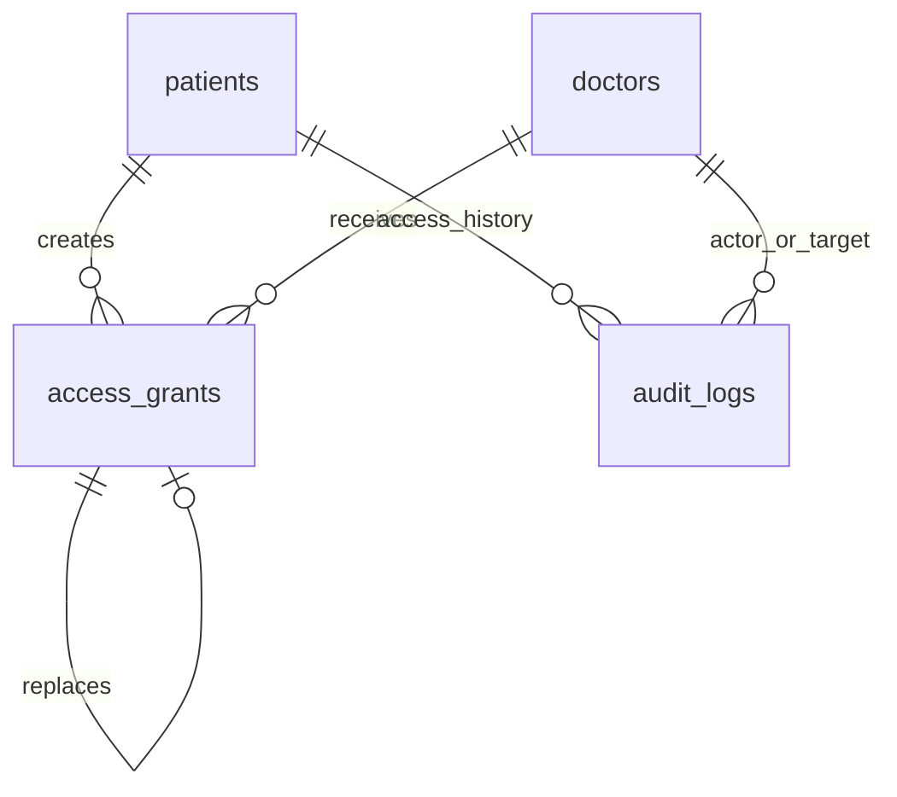
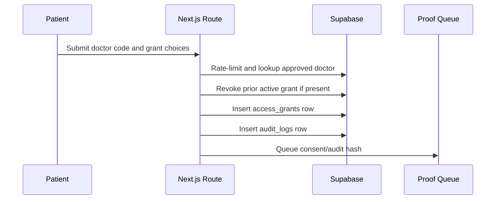

# Feature 04 - Patient-Controlled Doctor Access

## Feature Goal

Implement doctor discovery by QR/code, patient grant creation, active grant replacement, expiry, revocation, attachment-download permission, and patient-facing access history.

## Success Metrics

- Patients can find approved doctors by QR token or 6-digit code.
- Doctor code lookup is rate-limited and returns generic errors.
- Grants use boolean scope flags and finite expiry.
- New grant for same patient-doctor pair revokes prior active grant.
- Revoked/expired grants block doctor access on next request.
- Access history shows patient-relevant grant, revoke, doctor view, denied attempt, RAG, and proof-status events.

## Scope

- Patient Manage Doctor Access screen.
- QR scan/manual code entry flow.
- Doctor lookup for approved doctors only.
- Scope flag selection: Scope 1, Scope 2 mental, Scope 2 physical.
- Finite expiry date/time and >30 day warning.
- Attachment download permission toggle.
- Grant replacement and revoke flow.
- Patient access history.
- Rate limit table or server-side limiter for doctor code lookup.

## Non-Scope

- Doctor-initiated access extension.
- Free patient search by doctor.
- All-records PDF export.
- Break-glass emergency access.
- Sharing access through wallets or NFC cards.

## Assumptions

- QR token and Doctor Access Code identify approved doctors only; they are not credentials.
- At least one `can_view_*` flag must be true.
- Custom expiry has no maximum but must be finite.
- UI shows strong warning when expiry is more than 30 days away.

## Dependencies

- Approved doctor account and QR/code from Feature 01.
- `access_grants` schema and RLS from Feature 02.
- Audit and blockchain consent hashes from Feature 06.
- Doctor data enforcement from Feature 05.

## User Stories

- As a Patient, I can grant a doctor temporary access to exactly the data categories I choose.
- As a Patient, I can revoke access before expiry.
- As a Patient, I can see who accessed or attempted to access my data.
- As a Doctor, I cannot use QR/code alone to access data without patient grant.

## Acceptance Criteria

- Lookup only returns approved doctors.
- Failed lookup count is limited to 10 per 15 minutes and 20 per day per authenticated user plus IP.
- Failed lookups write audit events with generic reason.
- UI errors do not reveal whether a code exists.
- Grant creation revokes prior active grant for same patient-doctor pair and links `replaced_by_grant_id`.
- Backend uses explicit columns for active grant checks.
- Doctor access returns 403 if grant is absent, expired, revoked, or missing requested scope.
- Revocation writes audit and blockchain pending jobs.

## User Flow

```text
Patient opens Manage Doctor Access
-> scans QR or enters Doctor Access Code
-> backend finds approved doctor
-> UI shows doctor name and specialization
-> patient selects scope flags, expiry, download permission
-> backend revokes prior active grant if present
-> backend creates new grant, consent hash, audit log, blockchain pending job
```

Revoke:

```text
Patient selects active grant
-> confirms revoke
-> backend marks revoked and revoked_at
-> audit/proof job created
-> future doctor requests return 403
```

## UI Requirements

- Indonesian copy.
- Controls: checkboxes/toggles for scope and download flags; date/time input for expiry.
- Strong warning when expiry is more than 30 days away.
- Active grant list with doctor, scopes, expiry countdown, revoke action, and proof status.
- Access history with status, actor, action, time, and proof status.
- Required states: loading, empty, unauthorized, expired, revoked, blockchain pending/failed.

## Data Requirements

- `access_grants`: boolean scope flags, expiry, revoke fields, replacement link, consent hash, blockchain status.
- `audit_logs`: grant created/replaced/revoked, denied doctor access, failed code lookup.
- Rate limit persistence keyed by authenticated user plus IP.

## ERD / Data Model



## Architecture Notes

- Treat doctor lookup as discovery only. Every data route must independently validate active grant and requested scope.
- Use deterministic active grant query with explicit columns, expiry check, revocation check, and latest grant ordering.
- Keep generic error response for invalid, pending, rejected, revoked, or nonexistent doctor codes.
- Expiry/revoke enforcement happens server-side; UI countdown is only informational.

## Sequence Diagram



## Edge Cases

- Patient grants no scope.
- Expiry is in the past.
- Expiry exceeds 30 days.
- Existing active grant exists.
- Doctor is pending/rejected after code was shared.
- Rate limit window is exceeded.
- Revocation occurs while doctor view is open.

## Error States

- Invalid or unavailable code with generic message.
- Rate-limited lookup.
- Expired access.
- Revoked access.
- Unauthorized patient.
- Blockchain pending/failed.

## Task Breakdown Per Milestone

1. Build doctor lookup endpoint and rate limiter.
2. Build Manage Doctor Access UI.
3. Implement grant validation and creation.
4. Implement replacement of prior active grants.
5. Implement revoke flow.
6. Add patient access history.
7. Add consent/audit proof status hooks.
8. Validate expiry and revoked enforcement with doctor routes.

## Validation Checklist

- [ ] Invalid code and pending/rejected doctor produce generic errors.
- [ ] Rate limits trigger at defined thresholds.
- [ ] Grant cannot be created with zero scope flags.
- [ ] Grant requires finite future expiry.
- [ ] >30 day expiry warning appears.
- [ ] Replacement revokes prior active grant.
- [ ] Revoke blocks next doctor request.
- [ ] Access history shows required patient-relevant events.

## Risks

- Short doctor codes are brute-forceable. Rate-limit, generic errors, and audit failures are mandatory.
- Grant replacement can create two active grants if not transactional. Use transaction/RPC/server mutation with constraints.

## Decisions Log

| Decision | Final Choice |
|---|---|
| Grant scopes | Boolean flags |
| Expiry | Required finite timestamp, no max cap |
| Long expiry | UI warning beyond 30 days |
| Doctor code | 6-digit numeric, lookup only |
