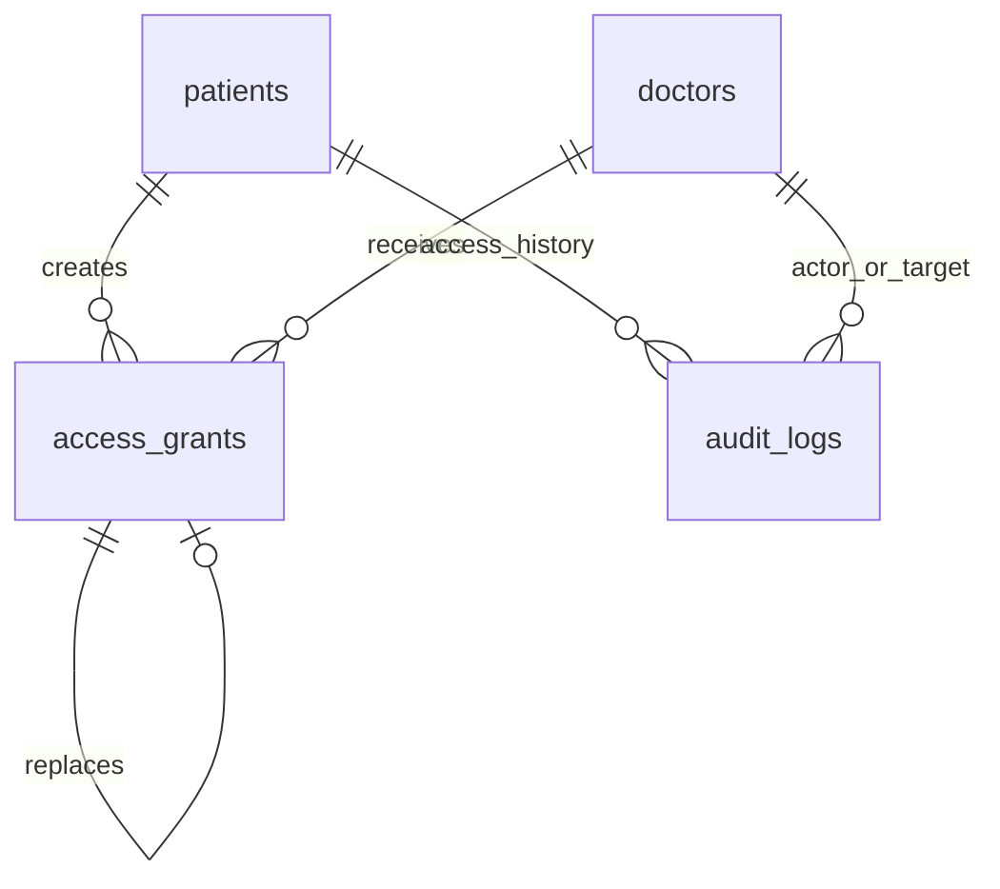
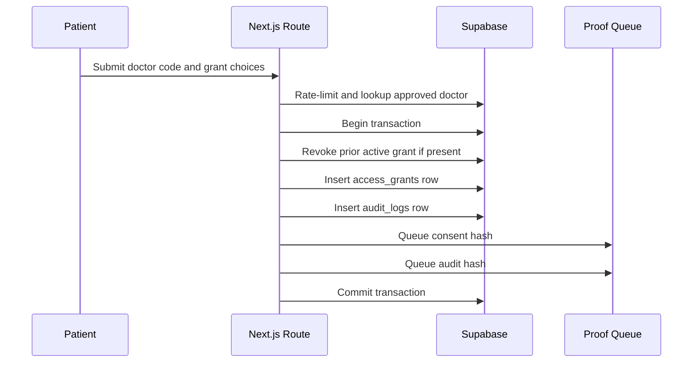

# Feature 04 - Patient-Controlled Doctor Access

## Feature Goal

Implement doctor discovery by QR/code, patient grant creation, active grant replacement, expiry, revocation, attachment-download permission, patient-facing access history, rate limiting, and traceable consent/audit proof events.

Exact table fields, constraints, allowed values, contract ABI, and source-flow details must follow `plans/sprint-01/Draft.md` whenever this spec is abbreviated.

## Success Metrics

- Patients can find approved doctors by QR token or 6-digit Doctor Access Code.
- Doctor code lookup is rate-limited with rolling 15-minute and rolling 24-hour failed-attempt windows and returns generic errors.
- Grants use boolean scope flags.
- Grant expiry is required, finite, and in the future.
- UI warns when expiry is more than 30 days away.
- New grant for the same patient-doctor pair revokes the prior active grant in the same transactional operation.
- Replacement/revoke creates new consent blockchain event and new audit blockchain event.
- Revoked or expired grants block doctor access on the next request.
- Access history shows patient-relevant grant, revoke, doctor view, denied attempt, RAG, and proof-status events.

## Scope

- Patient Manage Doctor Access screen.
- QR token scan/manual entry flow.
- 6-digit Doctor Access Code entry flow.
- Doctor lookup for approved doctors only.
- Rate limit persistence for failed Doctor Access Code lookup.
- Scope flag selection:
  - Scope 1.
  - Scope 2 mental.
  - Scope 2 physical.
- Attachment download permission toggle.
- Finite expiry date/time input.
- Strong warning for expiry more than 30 days away.
- Grant creation.
- Active grant replacement.
- Revocation.
- Patient access history.
- Consent hash generation and blockchain pending job.
- Audit log generation and blockchain pending job.

## Non-Scope

- Doctor-initiated access extension.
- Free patient search by doctor.
- All-records PDF export.
- Break-glass emergency access.
- Sharing access through wallets.
- NFC card access.
- Access without patient consent.

## Assumptions

- QR token and Doctor Access Code identify approved doctors only; they are not credentials.
- At least one `can_view_*` flag must be true.
- Custom expiry has no maximum but must be finite and future-dated.
- UI shows a strong warning when expiry is more than 30 days away.
- Every doctor data route independently validates active grant and requested scope.

## Dependencies

- Approved doctor account, QR token, and 6-digit code from Feature 01.
- `access_grants`, RLS, constraints, and indexes from Feature 02.
- Audit and blockchain proof behavior from Feature 06.
- Doctor data enforcement from Feature 05.
- UI states from Feature 07.

## User Stories

- As a Patient, I can grant a doctor temporary access to exactly the data categories I choose.
- As a Patient, I can replace an existing grant for the same doctor.
- As a Patient, I can revoke access before expiry.
- As a Patient, I can see who accessed or attempted to access my data.
- As a Doctor, I cannot use QR/code alone to access patient data without an active grant.

## Acceptance Criteria

- Lookup only returns approved doctors.
- Pending, rejected, revoked, invalid, or nonexistent doctor codes return generic errors.
- Failed lookup count is limited to 10 failed attempts per rolling 15 minutes and 20 failed attempts per rolling 24 hours per authenticated user plus IP.
- Failed lookup attempts are persisted with authenticated `auth_user_id`, normalized IP address, timestamp, lookup type, and generic failure reason.
- The short rolling window counts failed lookup rows where `created_at >= now() - interval '15 minutes'` for the same authenticated user plus IP before allowing another lookup.
- The daily rolling window counts failed lookup rows where `created_at >= now() - interval '24 hours'` for the same authenticated user plus IP before allowing another lookup.
- Failed lookups write `audit_logs` events with `action = 'doctor_access_code_lookup_failed'`, `access_status = 'failed'`, generic reason, and no sensitive content.
- UI errors do not reveal whether a code exists.
- Grant creation requires at least one scope flag.
- Grant creation requires finite future expiry.
- Expiry more than 30 days away shows a strong warning before submission.
- Attachment download is controlled by `can_download_attachments`.
- Grant creation, replacement, and revoke are transactional.
- Grant replacement revokes the prior active grant for the same patient-doctor pair and links `replaced_by_grant_id`.
- Every grant create/replace/revoke writes:
  - access grant row mutation
  - consent hash
  - consent blockchain pending event
  - audit log using `patient_grant_created`, `patient_grant_replaced`, or `patient_grant_revoked`
  - audit blockchain pending event
- Backend uses explicit columns for active grant checks.
- Backend never uses `SELECT *` in access-sensitive logic.
- Doctor access returns `403 Forbidden` if grant is absent, expired, revoked, or missing requested scope.

## Doctor Lookup Flow

```text
Patient opens Manage Doctor Access
-> patient scans QR token or enters Doctor Access Code
-> backend validates authenticated patient
-> backend checks failed Doctor Access Code attempts for same user plus IP in both rolling 15-minute and rolling 24-hour windows
-> backend looks up approved doctor only
-> invalid/pending/rejected/nonexistent code returns generic error
-> failed lookup writes audit log and proof pending job
-> successful lookup returns doctor name and specialization only
```

## Grant Creation Flow

```text
Patient selects approved doctor
-> patient selects Scope 1 / Scope 2 mental / Scope 2 physical flags
-> patient selects attachment download permission
-> patient selects finite future expiry
-> UI warns if expiry is more than 30 days away
-> backend validates patient ownership and doctor approval
-> backend validates at least one scope flag
-> backend validates expiry is finite and greater than transaction time
-> backend transaction starts
-> backend generates new grant_id before insert
-> backend captures one transaction timestamp for granted_at/revoked_at values
-> backend revokes prior active grant for same patient-doctor pair if present
-> backend builds canonical consent payload with HMAC IDs and computes consent_hash
-> backend inserts new access_grants row with consent_hash and blockchain_status pending
-> backend builds audit payload and inserts audit_logs row with audit_event_hash and blockchain_status pending
-> backend queues consent blockchain event
-> backend queues audit blockchain event
-> transaction commits
```

## Replacement Flow

```text
Patient creates a new grant for a doctor with an existing active grant
-> backend transaction finds latest active grant
-> backend captures one transaction timestamp for revoke/replace fields
-> backend computes prior grant replaced-state consent_hash using is_revoked = true, revoked_at, and replaced_by_grant_id = new grant_id
-> prior grant is marked is_revoked = TRUE
-> prior grant revoked_at is set
-> prior grant replaced_by_grant_id is linked to the new grant
-> prior grant consent_hash is updated, blockchain_tx_hash is cleared, and blockchain_status is set to pending
-> new grant consent_hash is computed before insert
-> new grant is inserted with blockchain_status pending
-> patient_grant_replaced audit event is written
-> consent blockchain events are queued for both the updated prior grant and the new grant
-> new audit blockchain event is queued
```

Rules:

- Replacement must not leave two active grants.
- Replacement must be atomic. If any required grant/audit/proof row fails, the mutation fails and no partial active state remains.
- Replacement is traceable through `replaced_by_grant_id`, consent proof for the prior replaced grant, consent proof for the new active grant, and audit history.

## Revoke Flow

```text
Patient selects active grant
-> patient confirms revoke
-> backend validates patient ownership
-> backend transaction starts
-> backend captures revoked_at from the transaction timestamp
-> backend builds revocation consent payload using is_revoked = true and revoked_at, then computes consent_hash
-> backend sets is_revoked = TRUE
-> backend sets revoked_at
-> backend updates consent_hash, clears blockchain_tx_hash, and sets blockchain_status = pending
-> backend writes patient_grant_revoked audit log with audit_event_hash and blockchain_status pending
-> backend queues consent blockchain event with isRevoked = true
-> backend queues audit blockchain event
-> transaction commits
-> future doctor requests return 403 Forbidden
```

Rules:

- Revocation does not delete records.
- Revocation does not delete prior audit/proof history.
- Revocation is enforced server-side on the next doctor data request.

## Exact Active Grant Query

Use explicit column selection and deterministic latest ordering:

```sql
SELECT
  grant_id,
  can_view_scope1,
  can_view_scope2_mental,
  can_view_scope2_physical,
  can_download_attachments,
  expires_at
FROM access_grants
WHERE doctor_id = :doctor_id
  AND patient_id = :patient_id
  AND expires_at > now()
  AND is_revoked = FALSE
ORDER BY granted_at DESC
LIMIT 1;
```

Required behavior:

- No `SELECT *`.
- If no row is returned, backend returns `403 Forbidden`.
- If requested scope flag is false, backend returns `403 Forbidden`.
- If `expires_at <= now()`, backend returns `403 Forbidden`.
- If `is_revoked = TRUE`, backend returns `403 Forbidden`.
- UI countdown is not authoritative.

## Access History Requirements

Patient-facing access history must show patient-relevant events:

- grant created
- grant replaced
- grant revoked
- doctor allowed patient data view
- doctor denied patient data view
- Doctor RAG request
- proof status events where relevant
- blockchain verification mismatch

Each entry should show:

- actor
- action
- target/context
- status
- time
- reason where safe and non-sensitive
- proof status

## UI Requirements

- Indonesian copy.
- Controls:
  - QR scan/manual code input.
  - Checkboxes or toggles for scope flags.
  - Toggle for attachment download permission.
  - Date/time input for expiry.
  - Revoke confirmation.
- Strong warning when expiry is more than 30 days away.
- Active grant list with:
  - doctor
  - scopes
  - attachment download permission
  - expiry countdown
  - revoke action
  - proof status
- Access history with:
  - actor
  - action
  - time
  - access/proof status
- Required states:
  - loading
  - empty
  - unauthorized
  - invalid/unavailable code generic error
  - rate-limited lookup
  - expired access
  - revoked access
  - blockchain pending
  - blockchain failed

## Data Requirements

- `access_grants`:
  - boolean scope flags
  - expiry
  - revoke fields
  - replacement link
  - consent hash
  - blockchain status
- `audit_logs`:
  - `patient_grant_created`
  - `patient_grant_replaced`
  - `patient_grant_revoked`
  - `doctor_patient_view_denied`
  - `doctor_access_code_lookup_failed`
- Rate limit persistence keyed by authenticated user plus IP.
- Rate limit persistence stores only failed lookup metadata: authenticated user, normalized IP, timestamp, lookup type, and generic reason.

Exact table fields and constraints are defined in Feature 02.

## ERD / Data Model



## Architecture Notes

- Treat doctor lookup as discovery only.
- Every data route must independently validate active grant and requested scope.
- Keep generic error responses for invalid, pending, rejected, revoked, or nonexistent doctor codes.
- Rate limiting must apply to failed code lookups.
- Rate limiting uses both the rolling 15-minute and rolling 24-hour failed-attempt windows from this spec.
- Expiry/revoke enforcement happens server-side.
- Grant create/replace/revoke must use a single database transaction.
- Consent hash payloads use HMAC patient/doctor IDs, not raw IDs.
- Audit hash payloads use HMAC actor/target IDs, not raw IDs.
- No patient name, diagnosis, symptoms, mood, anxiety, sleep, raw quote, prescription, or plaintext medical content is included in consent/audit proof payloads.

## Sequence Diagram



## Edge Cases

- Patient grants no scope.
- Expiry is in the past.
- Expiry is not finite.
- Expiry exceeds 30 days.
- Existing active grant exists.
- Two replacement submissions happen concurrently.
- Doctor is pending/rejected after code was shared.
- Doctor code exists but doctor is not approved.
- Short or daily rate limit window is exceeded.
- Failed lookup audit/proof write fails.
- Revocation occurs while doctor view is open.
- Revocation occurs while doctor is uploading attachment.
- Blockchain proof job fails after off-chain mutation commits.

## Error States

- Invalid or unavailable code with generic message.
- Rate-limited lookup.
- Zero scope selected.
- Invalid expiry.
- Expiry warning confirmation required.
- Expired access.
- Revoked access.
- Unauthorized patient.
- Transaction conflict.
- Blockchain pending.
- Blockchain failed.

## Task Breakdown Per Milestone

1. Build doctor lookup endpoint and rate limiter.
2. Build Manage Doctor Access UI.
3. Implement grant validation.
4. Implement transactional grant creation.
5. Implement transactional replacement of prior active grant.
6. Implement transactional revoke flow.
7. Add consent hash and consent proof job for create/replace/revoke.
8. Add audit log and audit proof job for create/replace/revoke and failed lookups.
9. Add patient access history.
10. Validate expiry and revoked enforcement with doctor routes.

## Validation Checklist

- [ ] Invalid code and pending/rejected doctor produce generic errors.
- [ ] Short rate limit triggers at 10 failed attempts per rolling 15 minutes.
- [ ] Daily rate limit triggers at 20 failed attempts per rolling 24 hours.
- [ ] Failed lookups write audit events.
- [ ] Grant cannot be created with zero scope flags.
- [ ] Grant requires finite future expiry.
- [ ] Expiry more than 30 days shows warning.
- [ ] Replacement revokes prior active grant.
- [ ] Replacement links `replaced_by_grant_id`.
- [ ] Replacement writes prior-grant consent proof, new-grant consent proof, and audit proof jobs.
- [ ] Revoke blocks next doctor request.
- [ ] Revoke writes consent proof and audit proof jobs.
- [ ] Only one active grant exists per patient-doctor pair.
- [ ] Active grant query uses explicit columns and latest ordering.
- [ ] Missing/expired/revoked/missing-scope access returns `403 Forbidden`.
- [ ] Access history shows required patient-relevant events.

## Risks

- Short doctor codes are brute-forceable. Rate-limit, generic errors, and audit failures are mandatory.
- Grant replacement can create two active grants if not transactional. Use a transaction/RPC/server mutation with constraints.
- Blockchain failure can lag proof status. Off-chain mutation remains durable and proof status shows pending/failed.
- UI can display stale countdown. Server-side grant validation remains authoritative.

## Decisions Log

| Decision | Final Choice |
|---|---|
| Grant scopes | Boolean flags |
| Expiry | Required finite future timestamp, no max cap |
| Long expiry | UI warning beyond 30 days |
| Doctor code | 6-digit numeric, lookup only |
| Code rate limit | 10 failed attempts per rolling 15 minutes and 20 failed attempts per rolling 24 hours per authenticated user plus IP |
| Replacement/revoke | Transactional and traceable |
| Consent proof | New consent event for create and revoke; replacement writes consent events for the prior replaced grant and the new active grant |
| Audit proof | New audit event for create, replace, revoke, failed lookup, and access events |
