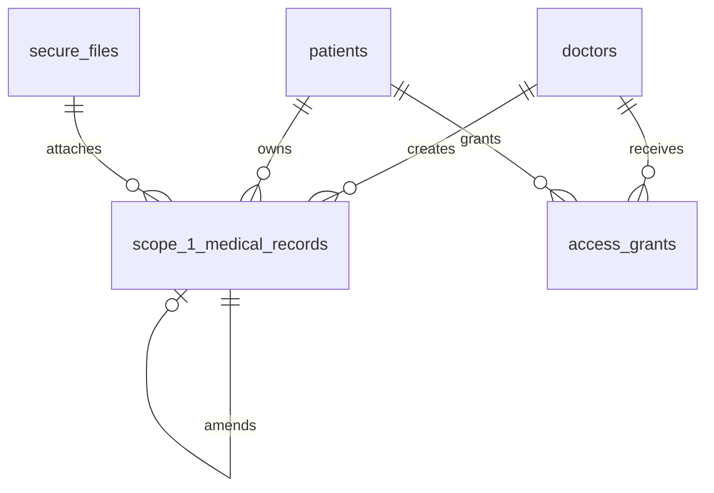
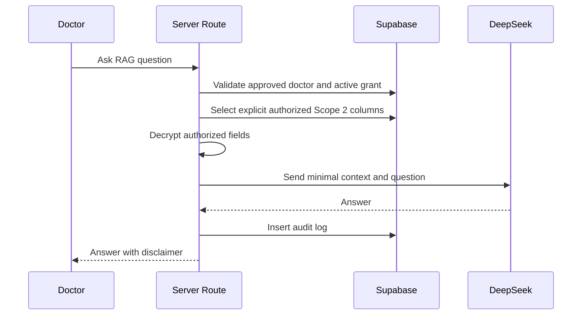

# Feature 05 - Doctor Data View, Scope 1 Records, Attachments, And RAG

## Feature Goal

Implement approved-doctor temporary patient data access, decrypted display after authorization, Scope 1 append-only record creation, encrypted attachment policy, and Doctor RAG over authorized Scope 2 data.

## Success Metrics

- Approved doctors see only patients with active grants.
- Doctor view locks after expiry/revoke on next data request.
- Scope panels render only granted categories.
- Scope 1 records are append-only and amendments link to originals.
- Attachment preview works while grant is active; download requires `can_download_attachments`.
- Doctor RAG uses only authorized Scope 2 explicit SQL retrieval and returns Indonesian disclaimer.

## Scope

- Doctor dashboard with QR Code, Doctor Access Code, active grants, and remaining time.
- Temporary patient data view.
- Scope 1 record timeline and creation form.
- Encrypted attachment preview/download policy.
- Scope 2 mental and physical display.
- Doctor RAG panel over authorized Scope 2 data.
- Audit events for allowed/denied views, Scope 1 creation/amendment, and RAG request.

## Non-Scope

- Doctor free-search patients.
- Doctor edits/deletes Scope 1 records.
- Doctor edits Scope 2 data.
- Scope 1 data in Doctor RAG context.
- All-records PDF export.
- AI diagnosis or treatment recommendation.

## Assumptions

- Doctors are manually approved before accessing dashboard.
- Scope 1 can be created only if active grant includes `can_view_scope1`.
- RAG questions and answers are text-only.
- Attachment bytes are already AES-encrypted before Supabase Storage upload.

## Dependencies

- Doctor approval and QR/code from Feature 01.
- Schema/RLS/storage from Feature 02.
- Patient Scope 2 from Feature 03.
- Grants from Feature 04.
- Audit/proof from Feature 06.

## User Stories

- As an approved Doctor, I can see patients who currently granted me access.
- As a Doctor, I can inspect only permitted Scope 1, Scope 2 mental, and Scope 2 physical panels.
- As a Doctor, I can add a new Scope 1 record if Scope 1 is granted.
- As a Doctor, I can ask AI questions over patient-generated Scope 2 data when authorized.

## Acceptance Criteria

- Pending/rejected doctors receive 403 for doctor feature APIs.
- Doctor dashboard has no patient search input.
- Patient data route validates approved doctor, active grant, expiry, revoke, and requested scope.
- Decryption happens only after authorization.
- Scope 1 save encrypts fields and attachment bytes before persistence.
- Record hash uses canonical encrypted payload, not plaintext medical content.
- Amendments create new rows with `amends_record_id`.
- RAG retrieves explicit permitted columns only, decrypts permitted fields only, sends minimal context to DeepSeek, and writes audit.

## User Flow

```text
Doctor opens dashboard
-> sees QR/code and active grants
-> opens patient data page
-> server validates active grant and scopes
-> UI renders allowed panels
-> doctor creates Scope 1 record if allowed
-> server encrypts fields/files and queues proof
```

RAG:

```text
Doctor asks question
-> server validates doctor approval and active grant
-> server determines permitted Scope 2 categories
-> explicit SQL retrieves encrypted rows
-> server decrypts authorized fields
-> DeepSeek receives minimal context
-> answer includes Indonesian disclaimer
-> audit/proof job written
```

## UI Requirements

- Indonesian copy.
- Doctor dashboard shows QR Code, 6-digit Doctor Access Code, active grants, and countdowns.
- Temporary patient view shows prominent countdown timer.
- Panels are hidden when not granted, not merely disabled.
- RAG panel shows mandatory disclaimer:

```text
Informasi ini dibuat dari data sesi AI MedProof pasien dan bukan diagnosis, asesmen medis, atau rekomendasi pengobatan. Gunakan hanya sebagai konteks awal, bukan sebagai satu-satunya dasar keputusan klinis.
```

- Required states: loading, empty, unauthorized, expired access, revoked access, upload failure, AI failure, blockchain pending/failed, integrity mismatch.

## Data Requirements

- `scope_1_medical_records`: encrypted record type/title/description, optional attachment, hash, blockchain status.
- `secure_files`: encrypted attachment metadata.
- `scope_2_mental`, `scope_2_physical`: encrypted authorized source data.
- `access_grants`: source of scope and download authorization.
- `audit_logs`: view, denied, Scope 1 create/amend, RAG request.

## ERD / Data Model



## Architecture Notes

- Put grant checks in shared server authorization functions used by all doctor routes.
- Treat UI countdown as a display only; all enforcement is request-time server validation.
- For RAG, never retrieve full rows. Select only columns required for permitted categories and question context.
- Keep prompts non-diagnostic and include provenance: dates, categories, raw quotes where authorized.
- Never include unauthorized Scope 2 category or Scope 1 data in RAG prompt.

## Sequence Diagram



## Edge Cases

- Grant expires while doctor has page open.
- Patient revokes access while doctor is uploading attachment.
- Attachment preview allowed but download disallowed.
- RAG question asks for unauthorized category.
- Scope 2 has no data for requested period.
- Blockchain proof still pending after record save.

## Error States

- Unauthorized doctor.
- Expired/revoked access.
- Missing scope.
- Upload failure.
- AI failure.
- No authorized data for RAG.
- Blockchain pending/failed/mismatch.

## Task Breakdown Per Milestone

1. Build doctor dashboard with active grants.
2. Add shared doctor authorization and scope-check helpers.
3. Build temporary patient data view.
4. Add encrypted attachment preview/download route.
5. Build Scope 1 create/amend flow.
6. Add Doctor RAG retrieval, prompt, response, and audit.
7. Add required empty/error/proof states.
8. Validate expiry/revoke/scope enforcement.

## Validation Checklist

- [ ] Pending/rejected doctors receive 403.
- [ ] Doctor cannot free-search patients.
- [ ] Doctor sees only active grant patients.
- [ ] Each panel respects scope flags.
- [ ] Revoked/expired grant blocks next request.
- [ ] Scope 1 record persists encrypted and append-only.
- [ ] Attachment download requires download flag.
- [ ] RAG uses only authorized Scope 2 columns and includes disclaimer.
- [ ] Audit logs written for view, denied, Scope 1, and RAG actions.

## Risks

- Shared auth helper mistakes can expose data. Centralize and test all routes with role matrix.
- RAG prompt leakage can include unauthorized categories. Build retrieval by grant flags, not by UI state.

## Decisions Log

| Decision | Final Choice |
|---|---|
| Doctor search | No free patient search |
| RAG scope | Authorized Scope 2 only |
| Scope 1 records | Append-only, amendments create new rows |
| Attachment download | Separate boolean permission |
