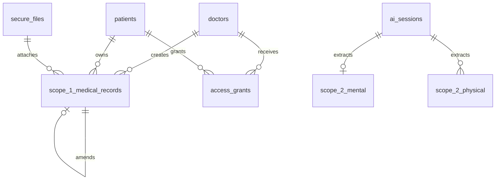
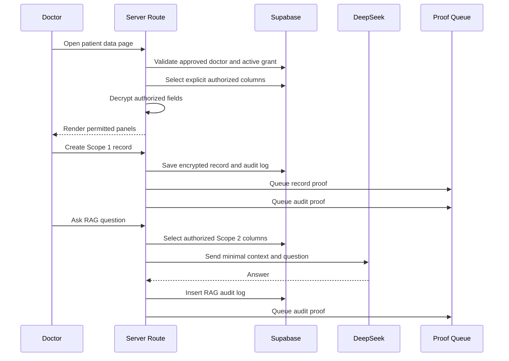

# Feature 05 - Doctor Data View, Scope 1 Records, Attachments, And RAG

## Feature Goal

Implement approved-doctor temporary patient data access, decrypted display after authorization, Scope 1 append-only record creation, encrypted attachment preview/download policy, and Doctor RAG over authorized Scope 2 data only.

Exact table fields, constraints, allowed values, contract ABI, and source-flow details must follow `plans/sprint-01/Draft.md` whenever this spec is abbreviated.

## Success Metrics

- Approved doctors see only patients with active grants.
- Pending/rejected doctors receive `403 Forbidden`.
- Doctor dashboard has no free patient search.
- Doctor view locks after expiry/revoke on the next data request.
- Scope panels render only granted categories.
- Scope 2 panels show decrypted raw quote, provenance/source, and emergency flags when authorized.
- Scope 1 records are append-only and amendments link to originals.
- Scope 1 save creates a record proof and an audit proof as separate proof events.
- Attachment preview works only while access is active.
- Attachment download requires `can_download_attachments = TRUE`.
- Doctor RAG uses only authorized Scope 2 explicit SQL retrieval and returns Indonesian disclaimer.

## Scope

- Doctor dashboard with QR Code, Doctor Access Code, active grants, and remaining access time.
- Temporary patient data view.
- Scope 1 record timeline.
- Scope 1 creation form.
- Scope 1 amendment flow.
- Encrypted attachment upload, preview, and download policy.
- Scope 2 mental display.
- Scope 2 physical display.
- Doctor RAG panel over authorized Scope 2 data.
- Audit events for:
  - `doctor_patient_view_allowed`
  - `doctor_patient_view_denied`
  - `scope1_record_created`
  - `scope1_record_amended`
  - `doctor_rag_requested`
- Blockchain proof status hooks for Scope 1 records and audit events.

## Non-Scope

- Doctor free-search patients.
- Doctor edits/deletes Scope 1 records.
- Doctor edits Scope 2 data.
- Patient edits extracted Scope 2 data.
- Scope 1 data in Doctor RAG context.
- All-records PDF export.
- AI diagnosis.
- Treatment recommendation.
- Advanced chart function calling.

## Assumptions

- Doctors are manually approved before accessing dashboard.
- Scope 1 can be created only if active grant includes `can_view_scope1`.
- RAG questions and answers are text-only.
- Attachment bytes are AES-encrypted before Supabase Storage upload.
- UI countdowns are informational only; server checks are authoritative.

## Dependencies

- Doctor approval and QR/code from Feature 01.
- Schema, RLS, storage, and encrypted fields from Feature 02.
- Patient Scope 2 data from Feature 03.
- Grants and access query behavior from Feature 04.
- Audit/proof from Feature 06.
- UI states from Feature 07.

## User Stories

- As an approved Doctor, I can see patients who currently granted me access.
- As a Doctor, I can inspect only permitted Scope 1, Scope 2 mental, and Scope 2 physical panels.
- As a Doctor, I can see Scope 2 provenance and raw quotes where authorized.
- As a Doctor, I can add a new Scope 1 record if Scope 1 is granted.
- As a Doctor, I can amend a Scope 1 record by creating a linked new row.
- As a Doctor, I can preview attachments while access is active.
- As a Doctor, I can download attachments only if the patient allowed downloads.
- As a Doctor, I can ask AI questions over patient-generated Scope 2 data when authorized.

## Acceptance Criteria

- Pending/rejected doctors receive `403 Forbidden` for doctor feature APIs.
- Doctor dashboard has no patient search input.
- Doctor dashboard shows only active grants for that doctor.
- Patient data route validates:
  - authenticated user
  - doctor role
  - `account_status = 'approved'`
  - active grant
  - expiry
  - revocation
  - requested scope flag
- Decryption happens only after authorization.
- Scope panels are hidden when not granted, not merely disabled.
- Scope 1 save validates allowed record type before encryption:
  - `lab`
  - `xray`
  - `diagnosis`
  - `prescription`
  - `vaccine`
  - `action`
  - `note`
- Scope 1 save encrypts record type, title, description, original filename, and attachment bytes before persistence.
- Record hash uses canonical encrypted payload, not plaintext medical content.
- Scope 1 save creates:
  - `scope_1_medical_records` row with `blockchain_status = 'pending'`
  - record proof job/event
  - `scope1_record_created` or `scope1_record_amended` audit log row
  - separate audit proof job/event
- Amendments create new rows with `amends_record_id`.
- Doctors cannot update/delete saved Scope 1 rows.
- Attachment preview is available only while grant is active and Scope 1 is granted.
- Attachment download requires active grant, Scope 1 grant, and `can_download_attachments = TRUE`.
- Doctor RAG retrieves explicit permitted columns only.
- Doctor RAG decrypts permitted fields only.
- Doctor RAG sends minimal relevant context to DeepSeek.
- Doctor RAG writes `doctor_rag_requested` audit log and queues audit proof.
- Doctor RAG response includes mandatory Indonesian disclaimer.

## Doctor Dashboard Flow

```text
Doctor signs in
-> server validates doctor role and account_status approved
-> dashboard shows QR Code and Doctor Access Code
-> dashboard shows active patient grants
-> dashboard shows remaining access time
-> no patient search is available
```

## Temporary Patient Data View Flow

```text
Doctor opens patient data page from active grant
-> server validates approved doctor
-> server runs active grant query with explicit columns
-> server checks expiry, revoke, and requested scope
-> server decrypts only authorized fields
-> UI renders only granted panels
-> UI shows prominent countdown timer
-> next request after expiry/revoke returns 403 Forbidden
```

## Scope 1 Panel

Visible only when `can_view_scope1 = TRUE`.

Panel must show:

- decrypted record timeline after backend authorization
- record type
- title
- description where available
- creator doctor
- created time
- amendment relationship where available
- attachment preview state where available
- blockchain proof status/hash where available
- Verify button only after the record proof transaction is confirmed

Rules:

- Records are append-only.
- Corrections create new records linked through `amends_record_id`.
- No edit/delete of saved Scope 1 rows.
- Attachment preview requires active access.
- Attachment download requires `can_download_attachments = TRUE`.

## Scope 2 Mental Panel

Visible only when `can_view_scope2_mental = TRUE`.

Panel must show authorized decrypted data where available:

- mood
- anxiety
- sleep
- trigger notes
- raw quote
- emergency flag
- log date
- AI session provenance/source
- extraction confidence where available
- AI model/schema version where useful
- non-diagnostic provenance/disclaimer

Rules:

- Extracted Scope 2 data is not editable.
- Unknown fields remain blank/null, not invented.
- Emergency flag display requires backend decryption after authorization.

## Scope 2 Physical Panel

Visible only when `can_view_scope2_physical = TRUE`.

Panel must show authorized decrypted data where available:

- symptom type
- severity
- body location
- duration note
- raw quote
- emergency flag
- log date
- AI session provenance/source
- extraction confidence where available
- AI model/schema version where useful
- non-diagnostic provenance/disclaimer

Rules:

- Extracted Scope 2 data is not editable.
- Unknown fields remain blank/null, not invented.
- Emergency flag display requires backend decryption after authorization.

## Scope 1 Input Flow

```text
Doctor opens Scope 1 form
-> server validates doctor auth, approval, active grant, and Scope 1 flag
-> doctor enters record type, title, description, optional attachment
-> server validates record type against allowed values
-> server generates record_id before insert
-> server encrypts clinical fields and attachment bytes
-> server saves encrypted attachment metadata if present
-> server builds canonical encrypted record payload and computes record_hash
-> server saves append-only scope_1_medical_records row with record_hash and blockchain_status pending
-> server builds audit payload and writes scope1_record_created or scope1_record_amended audit log with audit_event_hash and blockchain_status pending
-> server queues record proof event
-> server queues audit proof event
-> UI shows proof pending until confirmed
```

Required separate proof events:

- Record proof: `registerHealthRecord` for the Scope 1 record hash.
- Audit proof: `recordAuditEvent` for the Scope 1 create/amend audit log.

## Attachment Policy

Preview:

- Requires approved doctor.
- Requires active, unexpired, non-revoked grant.
- Requires `can_view_scope1 = TRUE`.
- Available only while access is active.
- Must stream/decrypt through guarded server route.

Download:

- Requires all preview requirements.
- Requires `can_download_attachments = TRUE`.
- If flag is false, backend returns `403 Forbidden`.

Rules:

- Attachment bytes are stored encrypted.
- Original filename is encrypted in `secure_files`.
- No all-records PDF export.
- Object paths must not reveal medical content.

## Doctor RAG Flow

```text
Doctor asks question
-> server validates doctor approval and active grant
-> server determines permitted Scope 2 categories from grant flags
-> server retrieves explicit encrypted columns for permitted categories only
-> server decrypts authorized fields only
-> server builds minimal context with dates, categories, provenance, and authorized raw quotes
-> server sends context and question to DeepSeek
-> server returns Indonesian answer with mandatory disclaimer
-> server writes doctor_rag_requested audit log
-> server queues audit proof event
```

Mandatory disclaimer:

```text
Informasi ini dibuat dari data sesi AI MedProof pasien dan bukan diagnosis, asesmen medis, atau rekomendasi pengobatan. Gunakan hanya sebagai konteks awal, bukan sebagai satu-satunya dasar keputusan klinis.
```

RAG rules:

- Authorized Scope 2 only.
- No Scope 1 context.
- No unauthorized Scope 2 category.
- No `SELECT *`.
- No diagnosis or treatment recommendation.
- No hidden patient search.
- If no authorized Scope 2 data exists, show an empty/no-data state.

## UI Requirements

- Indonesian copy.
- Doctor dashboard shows QR Code, 6-digit Doctor Access Code, active grants, and countdowns.
- Temporary patient view shows prominent countdown timer.
- Panels are hidden when not granted.
- Scope 2 panels show raw quote, provenance/source, and emergency flags where authorized.
- Scope 1 form uses clear controls and validates required fields.
- RAG panel shows mandatory disclaimer.
- Required states:
  - loading
  - empty
  - unauthorized
  - expired access
  - revoked access
  - missing scope
  - upload failure
  - AI failure
  - no authorized RAG data
  - blockchain pending
  - blockchain failed
  - integrity mismatch

## Data Requirements

- `scope_1_medical_records`: encrypted record type/title/description, optional attachment, record hash, blockchain status.
- `secure_files`: encrypted attachment metadata.
- `scope_2_mental`: encrypted authorized mental source data.
- `scope_2_physical`: encrypted authorized physical source data.
- `access_grants`: source of scope and download authorization.
- `audit_logs`: `doctor_patient_view_allowed`, `doctor_patient_view_denied`, `scope1_record_created`, `scope1_record_amended`, and `doctor_rag_requested`.

Exact table fields, constraints, indexes, and encryption patterns are defined in Feature 02.

## ERD / Data Model



## Architecture Notes

- Put grant checks in shared server authorization functions used by all doctor routes.
- Treat UI countdown as display only; all enforcement is request-time server validation.
- Use the exact active grant query behavior from Feature 04.
- For RAG, never retrieve full rows.
- Select only columns required for permitted categories and question context.
- Keep prompts non-diagnostic and include provenance.
- Never include unauthorized Scope 2 category or Scope 1 data in RAG prompt.
- Decrypt only after doctor approval and grant checks pass.
- Write allowed/denied view audit events as required by Feature 06.
- Store proof retry logic server-side.

## Sequence Diagram



## Edge Cases

- Grant expires while doctor has page open.
- Patient revokes access while doctor has page open.
- Patient revokes access while doctor is uploading attachment.
- Attachment preview allowed but download disallowed.
- Attachment object exists but grant expired before preview request.
- RAG question asks for unauthorized category.
- RAG question requests diagnosis or treatment recommendation.
- Scope 2 has no data for requested period.
- Scope 1 record save succeeds but blockchain proof is delayed.
- Audit proof fails while record proof succeeds.
- Record proof fails while audit proof succeeds.
- Doctor tries to amend a record without active Scope 1 grant.
- Pending/rejected doctor has stale dashboard URL.

## Error States

- Unauthorized doctor.
- Pending/rejected doctor.
- Expired access.
- Revoked access.
- Missing scope.
- Upload failure.
- Attachment preview denied.
- Attachment download denied.
- AI failure.
- No authorized data for RAG.
- Blockchain pending.
- Blockchain failed.
- Integrity mismatch.

## Task Breakdown Per Milestone

1. Build doctor dashboard with active grants.
2. Add shared doctor authorization and scope-check helpers.
3. Build temporary patient data view.
4. Add Scope 1/Scope 2 panel rendering by grant flags.
5. Add encrypted attachment preview route.
6. Add encrypted attachment download route with download flag enforcement.
7. Build Scope 1 create flow.
8. Build Scope 1 amend flow.
9. Add separate record proof and audit proof for Scope 1 saves.
10. Add Doctor RAG retrieval, prompt, response, audit, and proof.
11. Add required empty/error/proof states.
12. Validate expiry/revoke/scope enforcement.

## Validation Checklist

- [ ] Pending/rejected doctors receive `403 Forbidden`.
- [ ] Doctor cannot free-search patients.
- [ ] Doctor sees only active grant patients.
- [ ] Each panel respects scope flags.
- [ ] Panels are hidden when not granted.
- [ ] Revoked/expired grant blocks next request.
- [ ] Scope 2 panels show raw quote, provenance/source, and emergency flags where authorized.
- [ ] Scope 2 extracted data is not editable.
- [ ] Scope 1 record persists encrypted and append-only.
- [ ] Scope 1 amendment creates new linked row.
- [ ] Scope 1 save creates record proof event.
- [ ] Scope 1 save creates separate audit proof event.
- [ ] Attachment preview requires active Scope 1 access.
- [ ] Attachment download requires `can_download_attachments = TRUE`.
- [ ] RAG uses only authorized Scope 2 columns.
- [ ] RAG excludes Scope 1 data.
- [ ] RAG includes Indonesian disclaimer.
- [ ] Audit logs written for allowed view, denied view, Scope 1 create/amend, and RAG request.

## Risks

- Shared auth helper mistakes can expose data. Centralize and test all routes with the role matrix.
- RAG prompt leakage can include unauthorized categories. Build retrieval by grant flags, not UI state.
- Attachment routes can bypass UI restrictions. Enforce preview/download server-side.
- Proof events can be partially confirmed. UI must show record proof and audit proof independently.

## Decisions Log

| Decision | Final Choice |
|---|---|
| Doctor search | No free patient search |
| RAG scope | Authorized Scope 2 only |
| Scope 1 records | Append-only, amendments create new rows |
| Scope 2 edits | Not editable in Sprint 1 |
| Attachment preview | Active Scope 1 grant required |
| Attachment download | Active Scope 1 grant plus download flag required |
| Scope 1 proof | Separate record proof and audit proof |
