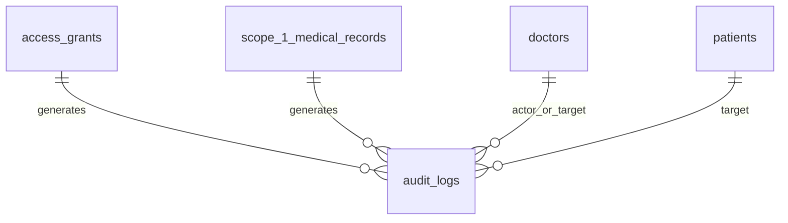
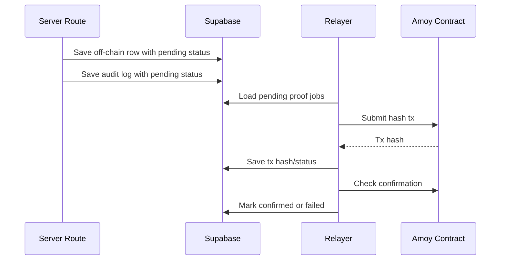

# Feature 06 - Audit Logging And Blockchain Proof

## Feature Goal

Implement audit logging, privacy-preserving hashes, Polygon Amoy smart contract integration, server relayer transactions, pending/failed retry status, and user-facing verification for Scope 1 records, access grants, and audit events.

Exact table fields, constraints, allowed values, contract ABI, and source-flow details must follow `plans/sprint-01/Draft.md` whenever this spec is abbreviated.

## Success Metrics

- Required sensitive actions write audit logs.
- Record, consent, and audit hashes contain no plaintext health content.
- On-chain IDs use HMAC with server-held pepper, not raw IDs.
- Proof hash is computed before the off-chain insert/update that stores it.
- Off-chain row is saved before blockchain write.
- Blockchain failures do not block core off-chain workflow.
- UI can show blockchain pending/failed/confirmed status and verification mismatch state.
- Before tx confirmation, verification is pending/unavailable.
- Verification is valid only after confirmation succeeds.
- Verify recomputes current encrypted payload/event hash and compares with the matching confirmed contract event hash.

## Scope

- `audit_logs` creation for required actions.
- Canonical JSON utility.
- SHA-256 hashing utility.
- HMAC pseudonymous patient/doctor/actor/target IDs.
- Solidity contract with exact Sprint 1 ABI.
- Hardhat config and deploy script for Polygon Amoy.
- Server relayer using viem and server env wallet.
- Pending/failed retry job or guarded server action.
- Proof status updates for records, grants, and audits.
- Verify endpoint.
- UI proof status hooks for:
  - Scope 1 records
  - access grants
  - patient access history

## Non-Scope

- User wallets.
- Mainnet deployment.
- Plaintext medical data on-chain.
- Patient/doctor wallet signatures.
- Deletion/retention automation.
- Full blockchain indexer.
- Advanced fraud analytics.

## Assumptions

- Polygon Amoy is the target network.
- Relayer private key is stored only in server environment.
- Contract address may be blank before deploy, but env validation must catch missing address for proof-enabled routes.
- Blockchain failures do not block off-chain saves.
- Users do not need wallets.
- All proof payloads are constructed server-side.

## Dependencies

- Exact schema and proof fields from Feature 02.
- Grant lifecycle from Feature 04.
- Scope 1 records from Feature 05.
- UI states from Feature 07.
- Environment validation from Feature 01.

## User Stories

- As a Patient, I can see proof status for access changes and access history events.
- As a Doctor, I can see proof status for Scope 1 records I create.
- As a Patient or Doctor, I can press Verify after confirmation and see whether current data matches the registered contract event proof.
- As an Admin, I can see KYC audit events without patient medical data.

## Acceptance Criteria

- Required audit events include these exact `action` values and matching `access_status` values:
  - `ai_processing_consent_accepted` with `access_status = 'accepted'`
  - `patient_grant_created` with `access_status = 'created'`
  - `patient_grant_replaced` with `access_status = 'replaced'`
  - `patient_grant_revoked` with `access_status = 'revoked'`
  - `doctor_patient_view_allowed` with `access_status = 'allowed'`
  - `doctor_patient_view_denied` with `access_status = 'denied'`
  - `scope1_record_created` with `access_status = 'created'`
  - `scope1_record_amended` with `access_status = 'amended'`
  - `doctor_rag_requested` with `access_status = 'allowed'`
  - `admin_doctor_approved` with `access_status = 'approved'`
  - `admin_doctor_rejected` with `access_status = 'rejected'`
  - `doctor_kyc_email_notification_failed` with `access_status = 'failed'`
  - `doctor_access_code_lookup_failed` with `access_status = 'failed'`
  - `blockchain_verification_mismatch` with `access_status = 'mismatch'`
- `record_hash = SHA256(canonical_json(encrypted_record_payload))`.
- `consent_hash = SHA256(canonical_json(consent_event_payload_with_hmac_ids))`.
- `audit_event_hash = SHA256(canonical_json(audit_event_payload_with_hmac_ids))`.
- HMAC values use `HASH_PEPPER`.
- Raw IDs are not placed on-chain.
- Patient names, diagnoses, prescriptions, symptoms, mood, anxiety, sleep data, raw quotes, and plaintext medical content are never placed on-chain.
- Blockchain status transitions are:
  - `pending`
  - `confirmed`
  - `failed`
- `blockchain_last_error` stores non-sensitive summary only.
- Verify before tx confirmation returns pending/unavailable state.
- Verify after tx confirmation recomputes local hash and compares with the matching confirmed contract event hash.
- Mismatch writes audit log and shows integrity warning.

## Exact Solidity Interface

The Sprint 1 contract must support this exact interface:

```solidity
function registerHealthRecord(
    bytes32 recordHash,
    bytes32 patientHash,
    bytes32 issuerHash,
    uint256 version
) external;

function recordConsent(
    bytes32 consentHash,
    bytes32 patientHash,
    bytes32 granteeHash,
    uint256 expiresAt,
    bool isRevoked
) external;

function recordAuditEvent(
    bytes32 auditEventHash,
    bytes32 actorHash,
    bytes32 targetHash,
    bytes32 actionHash
) external;

event HealthRecordRegistered(bytes32 indexed recordHash, bytes32 indexed patientHash, bytes32 indexed issuerHash, uint256 version);
event ConsentRecorded(bytes32 indexed consentHash, bytes32 indexed patientHash, bytes32 indexed granteeHash, uint256 expiresAt, bool isRevoked);
event AuditEventRecorded(bytes32 indexed auditEventHash, bytes32 indexed actorHash, bytes32 indexed targetHash, bytes32 actionHash);
```

Rules:

- `patientHash`, `issuerHash`, `granteeHash`, `actorHash`, and `targetHash` are HMAC outputs.
- `actionHash` is a hash of an action identifier, not raw sensitive content.
- `version` supports record payload versioning.
- Each write function must emit the matching event in the same successful transaction.
- Verify reads confirmed transaction receipts or indexed contract logs and compares the event hash argument with the recomputed local hash.
- Contract implementation must prevent duplicate registration of the same `recordHash`, `consentHash`, or `auditEventHash`; relayer retries must treat a duplicate matching hash as idempotent success after event lookup.
- ABI changes are out of scope unless `Draft.md` is updated.

## Privacy-Preserving Hashing

Do not hash raw IDs directly for on-chain values. Use a server-held hash pepper and HMAC for pseudonymous IDs.

Required patterns:

```text
patient_hash = HMAC_SHA256(HASH_PEPPER, patient_id)
doctor_hash = HMAC_SHA256(HASH_PEPPER, doctor_id)
actor_hash = HMAC_SHA256(HASH_PEPPER, actor_auth_user_id)
target_ref_hash = HMAC_SHA256(HASH_PEPPER, target_id) when a target ID exists
record_hash = SHA256(canonical_json(encrypted_record_payload))
consent_hash = SHA256(canonical_json(consent_event_payload_with_hmac_ids))
audit_event_hash = SHA256(canonical_json(audit_event_payload_with_hmac_ids))
```

Canonical JSON requirements:

- Stable key ordering.
- Stable UTC timestamp format.
- Stable version field where applicable.
- Explicit nulls for nullable included fields.
- No plaintext health content.
- No raw patient/doctor/auth IDs in proof payloads.
- Exclude mutable proof transport fields from proof payloads: `blockchain_tx_hash`, `blockchain_status`, and `blockchain_last_error`.

Exact proof payloads:

`encrypted_record_payload` includes exactly:

- `proof_type = "scope_1_record"`.
- `schema_version = "v1"`.
- `record_ref_hash = HMAC_SHA256(HASH_PEPPER, record_id)`.
- `patient_hash`.
- `doctor_hash`.
- `amends_record_ref_hash` or null.
- `record_type_ciphertext`, `record_type_iv`, `record_type_tag`.
- `title_ciphertext`, `title_iv`, `title_tag`.
- `description_ciphertext`, `description_iv`, `description_tag`.
- `attachment_file_ref_hash` or null.
- `attachment_file_sha256` or null.
- `key_version`.
- `created_at`.

`consent_event_payload_with_hmac_ids` includes exactly:

- `proof_type = "access_grant_consent"`.
- `schema_version = "v1"`.
- `grant_ref_hash = HMAC_SHA256(HASH_PEPPER, grant_id)`.
- `patient_hash`.
- `doctor_hash`.
- `can_view_scope1`.
- `can_view_scope2_mental`.
- `can_view_scope2_physical`.
- `can_download_attachments`.
- `granted_at`.
- `expires_at`.
- `is_revoked`.
- `revoked_at` or null.
- `replaced_by_grant_ref_hash` or null.
- `created_at`.

`audit_event_payload_with_hmac_ids` includes exactly:

- `proof_type = "audit_event"`.
- `schema_version = "v1"`.
- `log_ref_hash = HMAC_SHA256(HASH_PEPPER, log_id)`.
- `actor_hash`.
- `actor_role`.
- `action`.
- `target_type` or null.
- `target_ref_hash` or null.
- `patient_hash` or null.
- `doctor_hash` or null.
- `access_status`.
- `reason_code` or null, using only generic non-sensitive reason values.
- `created_at`.

## Transaction Policy

Hash first, then save off-chain:

```text
Sensitive event occurs
-> server generates stable row IDs needed by the proof payload
-> server captures one transaction timestamp for included timestamp fields
-> encrypted values and canonical payload are built
-> required hash is computed
-> off-chain row and audit row are saved with hash and blockchain_status pending
-> relayer sends Amoy tx
-> tx hash/status is saved
-> UI shows pending/confirmed/failed
-> Verify is available only after confirmation
```

If Polygon Amoy write is slow or fails:

- Build canonical proof payload and compute the required hash before insert/update.
- Save off-chain record/grant/audit with hash and `blockchain_status = 'pending'`.
- Retry through a controlled server job/action.
- If retry fails, set `blockchain_status = 'failed'`.
- Store only non-sensitive error summary.
- UI shows pending/failed/confirmed.
- Core off-chain workflow remains usable.

Relayer concurrency and idempotency rules:

- Relayer workers must claim candidate rows with row-level locking using `FOR UPDATE SKIP LOCKED`.
- A worker must re-read the source row after lock acquisition and skip rows already `confirmed`.
- A worker must not submit a transaction if a saved `blockchain_tx_hash` is still awaiting final receipt; it must poll that receipt first.
- If a worker crashes after submitting a tx but before saving the tx hash, a later retry may resubmit the same proof hash; the contract/event verification path must treat an already-registered matching hash as idempotent success, not data corruption.
- Duplicate or already-registered hash responses must be resolved by looking up the matching confirmed event hash before marking the row failed.
- Only sanitized error codes or summaries may be written to `blockchain_last_error`.

## Proof Placement

Scope 1 records:

- Show blockchain status.
- Show transaction hash when available.
- Show Verify button only after tx confirmation succeeds.
- Before confirmation, show proof status/explanation only; verification is unavailable.
- Verify recomputes `record_hash` from current encrypted payload.
- Mismatch shows integrity warning and writes audit log.

Access grants:

- Show consent proof status.
- Show transaction hash when available.
- Show Verify button after confirmation.
- Create a consent proof event for create and revoke.
- Replacement creates consent proof events for both the updated prior grant state and the new active grant state.
- Verify recomputes `consent_hash` from current consent payload with HMAC IDs.

Patient access history:

- Show audit proof status for patient-relevant audit events.
- Show transaction hash when available.
- Show Verify button after confirmation.
- Verification recomputes `audit_event_hash` from current audit payload.

Admin audit UI:

- Shows KYC audit proof status only.
- Must not expose patient medical data or patient audit rows.

## Verification State Rules

Database `blockchain_status` values:

- `pending`: tx not submitted or confirmation not complete. Verify result is unavailable/pending.
- `failed`: tx failed or retry failed. Verify result is unavailable until a confirmed tx exists.
- `confirmed`: tx confirmed. Verify can compare local hash with the matching confirmed event hash.

Verify endpoint result:

- `mismatch`: local recomputed hash differs from the matching confirmed event hash. Show integrity warning and write audit log.

Rules:

- Verification is valid only after confirmation succeeds.
- Verify before confirmation must not claim pass or fail.
- `mismatch` must never be stored in `blockchain_status`; it is returned by the Verify endpoint and stored only as `audit_logs.access_status = 'mismatch'` on the mismatch audit event.
- A missing contract address makes proof-enabled routes unavailable with clear non-sensitive config error.
- Verification mismatch must never print decrypted medical content.

## Data Requirements

- `scope_1_medical_records`:
  - `record_hash`
  - `blockchain_tx_hash`
  - `blockchain_status`
  - `blockchain_last_error`
- `access_grants`:
  - `consent_hash`
  - `blockchain_tx_hash`
  - `blockchain_status`
  - `blockchain_last_error`
- `audit_logs`:
  - `audit_event_hash`
  - `blockchain_tx_hash`
  - `blockchain_status`
  - `blockchain_last_error`
- Env:
  - `HASH_PEPPER`
  - `AMOY_RPC_URL`
  - `RELAYER_PRIVATE_KEY`
  - `MEDPROOF_CONTRACT_ADDRESS`

Exact fields and constraints are defined in Feature 02.

## UI Requirements

- Proof badges on Scope 1 records.
- Proof badges on access grants.
- Proof badges on patient access history.
- Verify button only where tx is confirmed.
- Pending/unavailable explanation before confirmation.
- Failed proof explanation with retry/status where relevant.
- Integrity mismatch warning is prominent and non-technical.
- Required states:
  - blockchain pending
  - blockchain failed
  - blockchain confirmed
  - verify unavailable
  - integrity mismatch

## ERD / Data Model



## Architecture Notes

- Canonical JSON must be deterministic across runtime environments.
- Use encrypted payload hashes for Scope 1 records.
- Use HMAC IDs for identities.
- Store proof retry logic server-side.
- Proof retry logic must use row-level claim locking and idempotent hash/event verification.
- Never expose relayer private key to browser.
- Relayer calls use viem.
- Hardhat deploy targets Polygon Amoy.
- Confirmation handling must update status deterministically.
- `blockchain_last_error` must not contain plaintext health content, raw prompts, or decrypted values.
- Audit proof and record/consent proof are separate events.

## Sequence Diagram



## Edge Cases

- Amoy RPC timeout.
- Relayer insufficient funds.
- Contract address missing.
- Tx submitted but confirmation delayed.
- Tx hash exists but receipt not confirmed.
- Verify before tx confirmation.
- Local encrypted payload changed after proof registration.
- Audit proof succeeds but record proof fails.
- Record proof succeeds but audit proof fails.
- Retry job runs twice.
- HMAC pepper is missing or changed.
- Canonical JSON order changes across deployments.
- Error message contains sensitive content and must be sanitized.

## Error States

- Blockchain pending.
- Blockchain failed.
- Verify unavailable.
- Contract config missing.
- Relayer config missing.
- Integrity mismatch.
- Retry exhausted.

## Task Breakdown Per Milestone

1. Add canonical JSON utility.
2. Add HMAC hash utility.
3. Add SHA-256 hash utility.
4. Add audit event writer.
5. Add Solidity contract with exact ABI.
6. Add contract tests.
7. Add Hardhat deploy config for Amoy.
8. Add relayer send/retry logic using viem.
9. Add confirmation polling/status updates.
10. Add proof status updates for Scope 1 records, access grants, and audits.
11. Add Verify endpoint.
12. Add UI proof states through Feature 07.

## Validation Checklist

- [ ] Hash payload fixtures are stable across key order.
- [ ] Timestamp canonicalization is stable.
- [ ] HMAC IDs do not expose raw UUIDs.
- [ ] No plaintext medical content appears in proof payloads.
- [ ] Contract exposes exact required functions and verification events.
- [ ] Contract deploy script targets Amoy.
- [ ] Pending status is saved before tx attempt.
- [ ] Failed tx stores non-sensitive error summary.
- [ ] Verification before confirmation is pending/unavailable.
- [ ] Verify passes for unchanged confirmed payload.
- [ ] Verify mismatch writes audit log and shows warning.
- [ ] Scope 1 records show proof placement.
- [ ] Access grants show proof placement.
- [ ] Patient access history shows proof placement.

## Risks

- Hashing plaintext would leak sensitive data irreversibly. Use encrypted payloads and HMAC IDs only.
- Network failure can make proof status lag. UI must explain pending/failed without blocking core workflow.
- ABI drift can break verification and relayer calls. Keep exact Draft ABI.
- Canonical JSON drift can cause false mismatch. Use fixtures and tests.

## Decisions Log

| Decision | Final Choice |
|---|---|
| Network | Polygon Amoy |
| Signer | Server relayer wallet |
| Contract ABI | Exact Draft interface |
| On-chain data | Privacy-preserving hashes only |
| Failure handling | Save first, pending/failed retry |
| Verification | Valid only after tx confirmation |
| Proof placement | Scope 1 records, access grants, patient access history |
