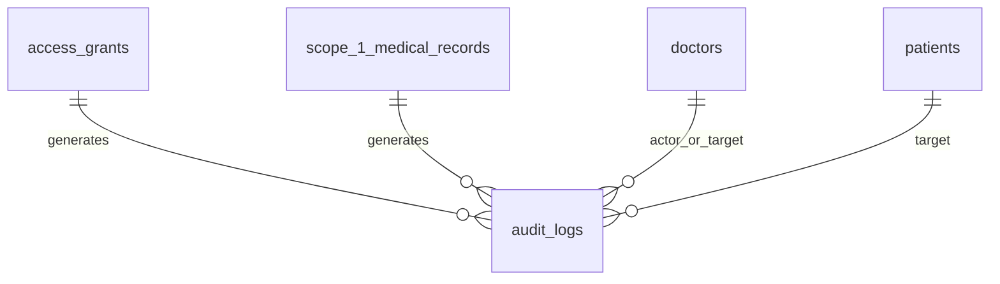
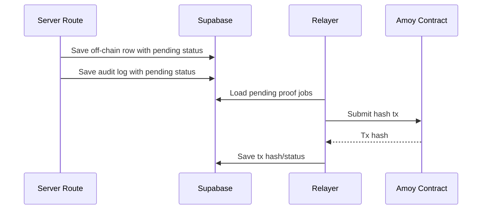

# Feature 06 - Audit Logging And Blockchain Proof

## Feature Goal

Implement audit logging, privacy-preserving hashes, Polygon Amoy smart contract integration, relayer transactions, pending/failed retry status, and user-facing verification for records, grants, and audit events.

## Success Metrics

- Required sensitive actions write audit logs.
- Record, consent, and audit hashes contain no plaintext health content.
- On-chain IDs use HMAC with server-held pepper, not raw IDs.
- Off-chain row is saved before blockchain write.
- UI can show pending, failed, confirmed, and mismatch status.
- Verify recomputes current encrypted payload/event hash and compares with on-chain value.

## Scope

- `audit_logs` creation for required actions.
- Canonical JSON and SHA-256 hashing.
- HMAC pseudonymous patient/doctor/actor/target IDs.
- Solidity contract with record, consent, and audit event functions.
- Hardhat deploy to Polygon Amoy.
- Server relayer using viem and env wallet.
- Retry job/server action for pending and failed txs.
- Verify endpoint and UI proof status hooks.

## Non-Scope

- User wallets.
- Mainnet deployment.
- Plaintext medical data on-chain.
- Deletion/retention automation.
- Full blockchain indexer.
- Advanced fraud analytics.

## Assumptions

- Polygon Amoy is target network.
- Relayer private key is stored only in server environment.
- Contract address may be blank before deploy but env validation must catch missing address for proof-enabled routes.
- Blockchain failures do not block off-chain saves.

## Dependencies

- Hashable encrypted payloads from Features 02, 04, and 05.
- Grant lifecycle from Feature 04.
- Scope 1 records from Feature 05.
- UI states from Feature 07.

## User Stories

- As a Patient, I can see proof status for access changes and access history events.
- As a Doctor, I can see proof status for Scope 1 records I create.
- As a Patient or Doctor, I can press Verify and see whether current data matches registered proof.
- As an Admin, I can see KYC audit events without patient medical data.

## Acceptance Criteria

- Required audit events include grant created/replaced/revoked, allowed/denied doctor view, Scope 1 created/amended, Doctor RAG request, admin approval/rejection, failed Doctor Access Code lookup, and verification mismatch.
- `record_hash = SHA256(canonical_json(encrypted_record_payload))`.
- `consent_hash = SHA256(canonical_json(consent_event_payload_with_hmac_ids))`.
- `audit_event_hash = SHA256(canonical_json(audit_event_payload_with_hmac_ids))`.
- HMAC values use `HASH_PEPPER`.
- Blockchain status transitions: `pending`, `confirmed`, `failed`.
- Non-sensitive `blockchain_last_error` stores summary only.
- Mismatch writes audit log and shows integrity warning.

## User Flow

```text
Sensitive event occurs
-> off-chain row and audit row saved
-> canonical payload hash computed
-> blockchain_status set pending
-> relayer sends Amoy tx
-> tx hash/status saved
-> user sees pending/confirmed/failed
-> Verify recomputes hash and compares with chain
```

## UI Requirements

- Proof badges on Scope 1 records, access grants, and patient access history.
- Verify button where tx hash exists or pending/failed state needs explanation.
- Integrity mismatch warning is prominent and non-technical.
- Required states: blockchain pending, blockchain failed, blockchain confirmed, integrity mismatch.

## Data Requirements

- `scope_1_medical_records`: `record_hash`, `blockchain_tx_hash`, `blockchain_status`, `blockchain_last_error`.
- `access_grants`: `consent_hash`, `blockchain_tx_hash`, `blockchain_status`, `blockchain_last_error`.
- `audit_logs`: `audit_event_hash`, `blockchain_tx_hash`, `blockchain_status`, `blockchain_last_error`.
- Env: `HASH_PEPPER`, `AMOY_RPC_URL`, `RELAYER_PRIVATE_KEY`, `MEDPROOF_CONTRACT_ADDRESS`.

## ERD / Data Model



## Architecture Notes

- Canonical JSON must use stable key order and timestamp format.
- Never hash raw names, diagnoses, prescriptions, symptoms, raw quotes, mood, anxiety, sleep data, or plaintext medical content into on-chain payloads.
- Use encrypted payload hashes for records and HMAC IDs for identities.
- Store proof retry logic server-side; no client wallet.
- Verification reads chain, recomputes local hash from current encrypted/off-chain payload, compares, and logs mismatch.

## Sequence Diagram



## Edge Cases

- Amoy RPC timeout.
- Relayer insufficient funds.
- Contract address missing.
- Tx submitted but confirmation delayed.
- Verify before tx confirmation.
- Local encrypted payload changed after proof registration.

## Error States

- Blockchain pending.
- Blockchain failed.
- Verify unavailable.
- Integrity mismatch.
- Relayer config missing.

## Task Breakdown Per Milestone

1. Add canonical JSON and HMAC hash utilities.
2. Add audit event writer.
3. Add Solidity contract and tests.
4. Add Hardhat deploy config for Amoy.
5. Add relayer send/retry logic using viem.
6. Add proof status updates for records, grants, and audits.
7. Add Verify endpoint.
8. Add UI proof states through Feature 07.

## Validation Checklist

- [ ] Hash payload fixtures are stable across key order.
- [ ] HMAC IDs do not expose raw UUIDs.
- [ ] No plaintext medical content appears in proof payloads.
- [ ] Contract deploy script targets Amoy.
- [ ] Pending status is saved before tx attempt.
- [ ] Failed tx stores non-sensitive error summary.
- [ ] Verify passes for unchanged payload.
- [ ] Verify mismatch writes audit log and shows warning.

## Risks

- Hashing plaintext would leak sensitive data irreversibly. Use encrypted payloads and HMAC IDs only.
- Network failure can make proof status lag. UI must explain pending/failed without blocking core workflow.

## Decisions Log

| Decision | Final Choice |
|---|---|
| Network | Polygon Amoy |
| Signer | Server relayer wallet |
| On-chain data | Privacy-preserving hashes only |
| Failure handling | Save first, pending/failed retry |
