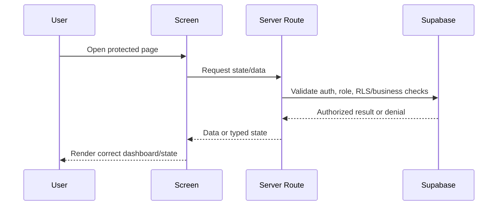

# Feature 07 - UI States, Copy, And Validation

## Feature Goal

Ensure all Sprint 1 screens use Indonesian application copy, restrained dashboard UI, required states, accessibility-friendly controls, and a validation checklist that proves the demo meets scope without adding future features.

## Success Metrics

- Required screens exist and route according to role/status.
- Indonesian UI copy is used for user-facing screens and AI responses.
- Required loading, empty, unauthorized, expired, revoked, pending, failed, upload, AI, blockchain, and mismatch states are visible where relevant.
- Manual QA covers Patient, Doctor, and Medical Admin flows.
- Validation report lists commands/checks, assumptions, risks, and out-of-scope items not touched.

## Scope

- Auth/sign-in entry.
- Patient onboarding/AI consent/profiling, dashboard, AI Chat, Manage Doctor Access, Access History.
- Doctor onboarding/KYC, pending/rejected status, dashboard, temporary patient view, Scope 1 form, RAG panel.
- Medical Admin dashboard and doctor review detail.
- Shared state components for loading/empty/unauthorized/error/proof states.
- Validation scripts and manual QA checklist once scaffold exists.

## Non-Scope

- Marketing landing page.
- Decorative hero or broad visual redesign.
- Future-scope screens.
- Mobile native app UI.
- Polished analytics/charts beyond required summaries.

## Assumptions

- shadcn/ui and Tailwind are used after scaffold.
- UI is web-first responsive dashboard/product UI.
- Visual polish is secondary to auth, RLS, encryption, audit, and authorization.

## Dependencies

- All feature implementations.
- Package scripts created during scaffold.
- Supabase local or staging project for RLS/migration checks.

## User Stories

- As a Patient, I can complete onboarding, chat, manage access, and understand proof/access states.
- As a Doctor, I can see my status, share QR/code, view authorized data, add records, and use RAG.
- As a Medical Admin, I can review doctors without patient data navigation.
- As a demo reviewer, I can see required security states clearly.

## Acceptance Criteria

- UI copy is Indonesian except repository docs/code identifiers.
- First screen is usable app auth, not marketing landing page.
- Role/status routing prevents wrong dashboards.
- Empty states exist for no records, no AI sessions, no grants, no KYC queue, no authorized Scope 2 data.
- Unauthorized/expired/revoked states are distinct.
- Blockchain pending/failed/confirmed/mismatch are distinct.
- AI and upload failures are recoverable or clearly explained.
- Manual QA checks prove non-scope features were not added.

## User Flow

```text
Anonymous user
-> sign-in screen
-> role resolver
-> Patient onboarding/dashboard OR Doctor status/dashboard OR Admin dashboard
-> affected pages show correct state based on data, role, grants, and proof status
```

## UI Requirements

- Use restrained dashboard/product layout.
- Use icons for tool buttons where available from existing icon library.
- Use checkboxes/toggles for binary options and clear buttons for commands.
- Avoid nested cards and decorative landing-page styling.
- Keep text within containers on mobile and desktop.
- Show non-medical-advice/demo disclaimer in AI and RAG contexts.
- Required screens:
  - Auth/sign-in
  - Patient onboarding/AI consent/profiling
  - Patient dashboard
  - Patient AI Chat
  - Patient Manage Doctor Access
  - Patient Access History
  - Doctor onboarding/KYC
  - Doctor pending/rejected status
  - Doctor dashboard
  - Doctor temporary patient data view
  - Doctor Scope 1 form
  - Doctor RAG panel
  - Medical Admin dashboard
  - Medical Admin doctor detail/review

## Data Requirements

- UI state derives from authoritative server data, not trusted client-only state.
- Proof status uses DB `blockchain_status` and verify endpoint result.
- Expiry/revoke UI uses backend response as source of truth.

## ERD / Data Model

No new tables required. This feature consumes all Sprint 1 tables and validation outputs.

## Architecture Notes

- Prefer server components/actions for protected data fetches and route-level authorization.
- Keep sensitive UI data loading server-side where feasible.
- Client components may handle interactive controls but must call guarded server routes.
- Shared status components should not expose decrypted data in logs or errors.
- Validation commands must run separately: lint is not implied by build.

## Sequence Diagram



## Edge Cases

- User switches role path manually by URL.
- Doctor grant expires during page interaction.
- Admin opens patient-data URL.
- AI provider unavailable.
- Storage upload fails.
- Blockchain proof pending for long time.
- No package scripts exist yet.

## Error States

- Loading.
- Empty.
- Unauthorized.
- Expired access.
- Revoked access.
- Pending doctor approval.
- Rejected doctor account.
- Upload failure.
- AI failure.
- Blockchain pending.
- Blockchain failed.
- Integrity mismatch.

## Task Breakdown Per Milestone

1. Define route groups and role/status redirects.
2. Build shared state components.
3. Build Patient screens and states.
4. Build Doctor screens and states.
5. Build Admin screens and states.
6. Add proof badges and Verify interactions.
7. Add validation scripts if missing.
8. Run automated checks and manual QA matrix.

## Validation Checklist

- [ ] `pnpm typecheck`.
- [ ] `pnpm lint`.
- [ ] `pnpm test`.
- [ ] `pnpm build`.
- [ ] Patient manual flow complete.
- [ ] Doctor manual flow complete.
- [ ] Admin manual flow complete.
- [ ] Anonymous and wrong-role URL access denied.
- [ ] Expired/revoked grant states render.
- [ ] Upload/AI/blockchain failures render.
- [ ] No future-scope screens or features added.

## Risks

- UI can hide but not enforce permissions. Server routes and RLS must remain authoritative.
- Sprint scope pressure may tempt skipping states. Required state coverage is acceptance criteria.

## Decisions Log

| Decision | Final Choice |
|---|---|
| UI language | Indonesian |
| UI style | Restrained dashboard/product UI |
| Landing page | Out of scope; auth/app first |
| Validation | Automated checks plus role/manual QA matrix |
