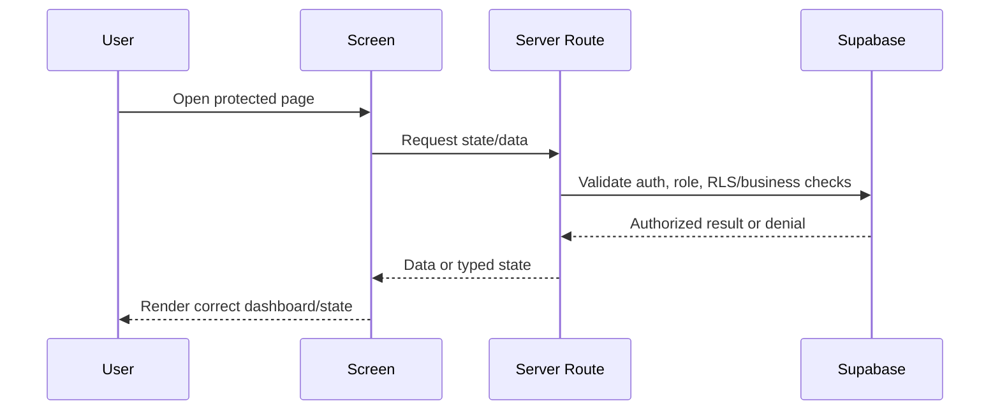

# Feature 07 - UI States, Copy, And Validation

## Feature Goal

Ensure all Sprint 1 screens use Indonesian application copy, restrained dashboard UI, authoritative server-driven state, required security/error/proof states, accessibility-friendly controls, and validation that proves the demo meets `Draft.md` scope without adding future features.

Exact table fields, constraints, allowed values, contract ABI, and source-flow details must follow `plans/sprint-01/Draft.md` whenever this spec is abbreviated.

## Success Metrics

- Required screens exist and route according to role/status.
- Indonesian UI copy is used for user-facing screens and AI responses.
- First screen is usable app auth, not a marketing landing page.
- Required loading, empty, unauthorized, expired, revoked, pending, rejected, upload, AI, blockchain, and mismatch states are visible where relevant.
- Patient dashboard contains every required item from `Draft.md`.
- No all-records PDF export exists.
- Manual QA covers Patient, Doctor, and Medical Admin flows.
- Validation includes plaintext database/storage checks and encrypted-only storage verification.
- Validation report lists commands/checks, assumptions, risks, and out-of-scope items not touched.

## Scope

- Auth/sign-in entry.
- Patient onboarding, AI consent, and profiling.
- Patient dashboard.
- Patient AI Chat.
- Patient Manage Doctor Access.
- Patient Access History.
- Doctor onboarding/KYC.
- Doctor pending/rejected status.
- Doctor dashboard.
- Doctor temporary patient data view.
- Doctor Scope 1 form.
- Doctor RAG panel.
- Medical Admin dashboard.
- Medical Admin doctor detail/review.
- Shared state components for loading, empty, unauthorized, error, access, upload, AI, and proof states.
- Validation scripts and manual QA checklist once scaffold exists.
- Plaintext DB/storage inspection validation.
- Encrypted-only storage verification.

## Non-Scope

- Marketing landing page.
- Decorative hero.
- Broad visual redesign.
- Future-scope screens.
- Mobile native app UI.
- Polished analytics/charts beyond required summaries.
- All-records PDF export.
- SATUSEHAT.
- KKI API automation.
- Emergency dispatch/SOS.
- Wallets.
- NFC cards.
- Web push.
- FHIR export.
- Predictive insights.

## Assumptions

- shadcn/ui and Tailwind are used after scaffold.
- UI is web-first responsive dashboard/product UI.
- Visual polish is secondary to auth, RLS, encryption, audit, and authorization.
- UI state derives from authoritative server data.
- Server routes and RLS enforce permissions; UI only reflects state.

## Dependencies

- Feature 01 foundation/auth/admin.
- Feature 02 schema/RLS/storage/encryption.
- Feature 03 patient AI journaling.
- Feature 04 patient-doctor access.
- Feature 05 doctor view/records/RAG.
- Feature 06 audit/blockchain proof.
- Package scripts created during scaffold.
- Supabase local or staging project for RLS/migration checks.

## User Stories

- As a Patient, I can complete onboarding, chat, manage access, and understand proof/access states.
- As a Patient, I can see a dashboard with greeting, health summaries, active grants, access history, and proof indicators.
- As a Doctor, I can see my status, share QR/code, view authorized data, add records, preview/download attachments according to policy, and use RAG.
- As a Medical Admin, I can review doctors without patient data navigation.
- As a demo reviewer, I can see required security states clearly.

## Acceptance Criteria

- UI copy is Indonesian except repository docs, code identifiers, logs, and internal developer-only text.
- First screen is app auth/sign-in, not marketing.
- Role/status routing prevents wrong dashboards.
- Anonymous protected routes are denied.
- Wrong-role direct URL access is denied.
- Pending/rejected doctors cannot see doctor dashboard, QR Code, Doctor Access Code, patient grants, patient data, Scope 1 form, or RAG panel.
- Medical Admin UI has no patient-data navigation.
- Empty states exist for:
  - no records
  - no AI sessions
  - no Scope 2 data
  - no grants
  - no KYC queue
  - no authorized Scope 2 data for RAG
- Unauthorized/expired/revoked/missing-scope states are distinct.
- Blockchain pending/failed/confirmed states and verification mismatch state are distinct.
- Verify before confirmation shows pending/unavailable, not pass/fail.
- AI chat is unavailable until the patient-owned `ai_processing_consent_accepted` audit event exists.
- AI and upload failures are recoverable or clearly explained.
- No all-records PDF export exists anywhere.
- Manual QA checks prove non-scope features were not added.
- Validation checks prove no plaintext health content is stored in database rows or storage objects.

## Required Screens

- Auth/sign-in.
- Patient onboarding/AI consent/profiling.
- Patient dashboard.
- Patient AI Chat.
- Patient Manage Doctor Access.
- Patient Access History.
- Doctor onboarding/KYC.
- Doctor pending/rejected status.
- Doctor dashboard.
- Doctor temporary patient data view.
- Doctor Scope 1 form.
- Doctor RAG panel.
- Medical Admin dashboard.
- Medical Admin doctor detail/review.

## Exact Patient Dashboard Contents

Patient dashboard must show:

- Personal greeting.
- Primary CTA to open AI Chat.
- Scope 1 recent records summary.
- Scope 2 recent journal summary.
- Active doctor access list with expiry.
- Access history entry point or recent access history entries.
- Blockchain/proof verification indicators where relevant.

Required dashboard empty/pending states:

- No Scope 1 records.
- No AI sessions.
- No Scope 2 journal data.
- No active doctor access.
- Pending blockchain proof.
- Failed blockchain proof where relevant.

## Required State Matrix

Global:

- Loading.
- Empty.
- Unauthorized.
- Forbidden/wrong role.

Doctor access:

- Expired access.
- Revoked access.
- Missing scope.
- Pending doctor approval.
- Rejected doctor account.

Operations:

- Upload failure.
- AI failure.
- Extraction validation failure.
- Rate-limited doctor code lookup.
- Email notification failure for admin review flow.

Proof:

- Blockchain pending.
- Blockchain failed.
- Blockchain confirmed.
- Verify unavailable before confirmation.
- Integrity mismatch.
- AI consent missing.

## UI Requirements

- Use restrained dashboard/product layout.
- Use icons for tool buttons where available from existing icon library.
- Use checkboxes/toggles for binary options.
- Use date/time inputs for expiry.
- Use clear buttons for commands.
- Avoid nested cards and decorative landing-page styling.
- Keep text within containers on mobile and desktop.
- Show non-medical-advice/demo disclaimer in AI and RAG contexts.
- Show DeepSeek processing disclosure before AI use.
- Panels hidden when not granted, not merely disabled.
- UI countdowns are informational only; backend state is authoritative.
- No all-records PDF export button, route, menu item, server action, or API endpoint.

## Data Requirements

- UI state derives from authoritative server data, not trusted client-only state.
- Proof status uses DB `blockchain_status` and verify endpoint result.
- Expiry/revoke UI uses backend response as source of truth.
- Patient dashboard summaries load through patient-owned server authorization.
- Doctor panels load only through approved-doctor active-grant authorization.
- Admin screens load only KYC/admin data.

## Validation Requirements

Automated commands once scripts exist:

- `pnpm typecheck`
- `pnpm lint`
- `pnpm test`
- `pnpm build`

Supabase/database validation:

- Migration apply/verify against local or staging Supabase.
- Supabase security advisor review.
- Supabase performance advisor review.
- RLS checks for:
  - anonymous
  - Patient
  - approved Doctor
  - pending Doctor
  - rejected Doctor
  - Medical Admin
- Data API grants/exposure checks for intended tables and private tables.
- Plaintext database check after seeded demo flows:
  - no patient names in encrypted medical fields
  - no diagnoses in plaintext medical rows
  - no prescriptions in plaintext medical rows
  - no symptoms in plaintext medical rows
  - no mood/anxiety/sleep/raw quotes in plaintext
  - no raw AI prompts or decrypted messages in logs/tables
- Encrypted-only storage verification:
  - KYC stored bytes are encrypted
  - medical attachment stored bytes are encrypted
  - direct storage object read is unreadable without app key
  - object paths do not reveal medical content
- Doctor Access Code rate-limit verification covers both 10 failed attempts per rolling 15 minutes and 20 failed attempts per rolling 24 hours per authenticated user plus IP.
- Access expiry/revocation verification.
- Blockchain pending/failed/confirmed verification plus Verify mismatch verification.

Manual QA:

- Patient full flow.
- Doctor full flow.
- Medical Admin full flow.
- Anonymous and wrong-role URL access.
- Pending/rejected doctor access denial.
- Expired/revoked grant rendering.
- Upload/AI/blockchain failure rendering.
- No future-scope screens or features.
- No all-records PDF export.

## ERD / Data Model

No new tables required. This feature consumes all Sprint 1 tables and validation outputs.

## Architecture Notes

- Prefer server components/actions for protected data fetches and route-level authorization.
- Keep sensitive data loading server-side where feasible.
- Client components may handle interactive controls but must call guarded server routes.
- Shared status components must not expose decrypted data in logs or errors.
- Validation commands must run separately; lint is not implied by build.
- UI hidden states are not security boundaries.
- Server routes, RLS, and storage policies remain authoritative.

## User Flow

```text
Anonymous user
-> sign-in screen
-> Supabase Google OAuth
-> role resolver
-> Patient onboarding/dashboard OR Doctor status/dashboard OR Admin dashboard
-> affected pages request server state
-> server validates auth, role, grant, and proof state
-> UI renders correct dashboard/state
```

## Sequence Diagram



## Edge Cases

- User switches role path manually by URL.
- Doctor grant expires during page interaction.
- Patient revokes grant while doctor page is open.
- Admin opens patient-data URL.
- Pending/rejected doctor opens stale dashboard URL.
- AI provider unavailable.
- AI stream partially fails.
- Storage upload fails.
- Attachment preview is requested after grant expiry.
- Attachment download is requested without download flag.
- Blockchain proof remains pending for long time.
- Verify is clicked before tx confirmation.
- Package scripts do not exist yet.
- No Supabase local/staging project is configured yet.
- UI accidentally adds future-scope action such as PDF export.

## Error States

- Loading.
- Empty.
- Unauthorized.
- Forbidden.
- Expired access.
- Revoked access.
- Missing scope.
- Pending doctor approval.
- Rejected doctor account.
- Upload failure.
- AI failure.
- Extraction failure.
- Rate-limited lookup.
- Email notification failure.
- Blockchain pending.
- Blockchain failed.
- Verify unavailable.
- Integrity mismatch.

## Task Breakdown Per Milestone

1. Define route groups and role/status redirects.
2. Build shared state components.
3. Build Patient screens and exact dashboard contents.
4. Build Doctor screens and states.
5. Build Admin screens and states.
6. Add proof badges and Verify interactions.
7. Add validation scripts if missing.
8. Add plaintext DB/storage inspection checks.
9. Add encrypted-only storage verification.
10. Run automated checks and manual QA matrix.
11. Confirm no future-scope features and no all-records PDF export.

## Validation Checklist

- [ ] `pnpm typecheck`.
- [ ] `pnpm lint`.
- [ ] `pnpm test`.
- [ ] `pnpm build`.
- [ ] Migration apply/verify completed.
- [ ] Supabase security advisor reviewed.
- [ ] Supabase performance advisor reviewed.
- [ ] RLS role matrix completed.
- [ ] Data API grants/exposure checked.
- [ ] Patient manual flow complete.
- [ ] Doctor manual flow complete.
- [ ] Admin manual flow complete.
- [ ] Anonymous and wrong-role URL access denied.
- [ ] Pending/rejected doctors denied.
- [ ] AI chat blocked until `ai_processing_consent_accepted` audit event exists.
- [ ] Patient dashboard shows exact Draft contents.
- [ ] Expired/revoked/missing-scope states render distinctly.
- [ ] Upload/AI/blockchain failures render.
- [ ] Verify before confirmation renders pending/unavailable.
- [ ] Doctor Access Code short and daily rate-limit windows pass.
- [ ] Integrity mismatch renders warning and writes audit.
- [ ] Plaintext DB check passes.
- [ ] Encrypted-only storage verification passes.
- [ ] No all-records PDF export exists.
- [ ] No future-scope screens or features added.

## Risks

- UI can hide but not enforce permissions. Server routes and RLS must remain authoritative.
- Sprint scope pressure may tempt skipping states. Required state coverage is acceptance criteria.
- Plaintext leakage can hide in logs, filenames, object paths, or proof payloads. Validate all storage surfaces.
- Proof UX can overclaim before confirmation. Verification is valid only after confirmed tx.

## Decisions Log

| Decision | Final Choice |
|---|---|
| UI language | Indonesian |
| UI style | Restrained dashboard/product UI |
| Landing page | Out of scope; auth/app first |
| Validation | Automated checks plus role/manual QA matrix |
| PDF export | Out of scope and must not exist |
| Plaintext validation | Required DB/log/storage checks |
